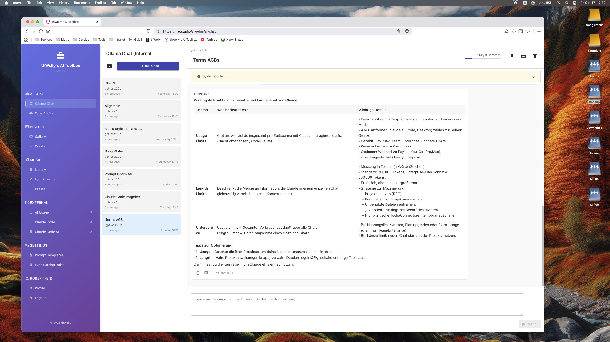

# thWelly's AI Toolbox



> A full-stack platform for AI-powered creative content generation - combining image generation, music creation, lyric writing, and project management in one cohesive application.

[](https://github.com/rwellinger/aiproxy/actions)
[](LICENSE)
[](https://angular.io/)
[](https://www.python.org/)

---

## What is this?

**thWelly's AI Toolbox** is a personal AI multimedia platform that I built to explore and integrate various AI APIs into a unified, production-ready application. It demonstrates modern full-stack architecture patterns, async processing, and clean code practices.

**Key highlights:**
- Full-stack application with Angular 20 frontend and FastAPI backend
- Integration of multiple AI services (OpenAI, Mureka, Ollama)
- Async task processing with Celery for long-running operations
- S3-compatible storage with hybrid filesystem/cloud architecture
- CLI tool for local workflow integration
- Comprehensive arc42 architecture documentation

---

## Features

### AI Chat
- Multi-model support (Ollama LLMs: Llama, Mistral, etc.)
- Persistent conversation history with context management
- Token usage tracking with visual indicators
- Markdown rendering with syntax highlighting

### Image Generation
- DALL-E 3 integration via OpenAI API
- One-click AI-powered prompt enhancement
- Text overlay editor for adding titles/artist names
- Gallery view with filtering and search
- Usage cost tracking

### Music Generation
- Mureka API integration for AI song generation
- Async processing via Celery workers
- Stem separation support
- Multiple model selection

### Lyric Creation
- Section-based editor (Verse, Chorus, Bridge, etc.)
- AI-powered improvement, rewriting, and extension
- Song architecture builder with drag & drop
- Integration with music generator

### Song Sketches
- Organize song ideas before generation
- Workflow management (draft, used, archived)
- AI-powered title generation
- Direct conversion to full songs

### Song Projects
- Complete project management for music production
- Hierarchical folder structure (Arrangement, Mixing, Stems, etc.)
- S3 cloud storage with batch upload/download
- CLI integration for local DAW workflow

### Equipment Management
- Track music production software and plugins
- Secure credential storage (encrypted)
- License management (iLok, online, keys)

---

## Tech Stack

| Layer | Technologies |
|-------|-------------|
| **Frontend** | Angular 20, TypeScript, Angular Material, SCSS, RxJS |
| **Backend** | Python 3.12, FastAPI, SQLAlchemy 2.0, Pydantic 2.0 |
| **Async Processing** | Celery 5.4, Redis |
| **Database** | PostgreSQL 15 |
| **Storage** | S3-compatible (MinIO, AWS S3, Backblaze B2) |
| **AI Services** | OpenAI (DALL-E 3, GPT), Mureka, Ollama |
| **Deployment** | Docker, Docker Compose, Nginx, GitHub Actions |
| **Code Quality** | Ruff (Python), ESLint (TypeScript), import-linter |

---

## Architecture

This project follows a **3-layer architecture** with strict separation of concerns:

```
┌─────────────────────────────────────────────────────────────┐
│                    Frontend (Angular 20)                     │
│  ┌─────────┐  ┌─────────┐  ┌─────────┐  ┌─────────────────┐ │
│  │  Pages  │  │Services │  │Components│  │ ApiConfigService│ │
│  └────┬────┘  └────┬────┘  └─────────┘  └────────┬────────┘ │
└───────┼────────────┼────────────────────────────┼───────────┘
        │            │                            │
        ▼            ▼                            ▼
┌─────────────────────────────────────────────────────────────┐
│                   Backend (FastAPI)                          │
│  ┌────────────┐  ┌─────────────┐  ┌──────────────────────┐  │
│  │ Controller │→ │ Orchestrator │→ │ Transformer/Service │  │
│  │  (HTTP)    │  │ (Coordinate) │  │  (Pure Functions)   │  │
│  └────────────┘  └──────┬──────┘  └──────────────────────┘  │
│                         │                                    │
│  ┌──────────────────────┴───────────────────────────────┐   │
│  │              Repository Layer (CRUD)                  │   │
│  └───────────────────────┬──────────────────────────────┘   │
└──────────────────────────┼──────────────────────────────────┘
                           │
        ┌──────────────────┼──────────────────┐
        ▼                  ▼                  ▼
┌──────────────┐  ┌──────────────┐  ┌──────────────┐
│  PostgreSQL  │  │    Redis     │  │  S3 Storage  │
└──────────────┘  └──────────────┘  └──────────────┘
```

**Key patterns:**
- **Controller Layer**: HTTP handling, validation (Pydantic), JWT auth
- **Orchestrator Layer**: Coordinates services, no business logic
- **Transformer Layer**: Pure functions (100% unit-testable)
- **Repository Layer**: CRUD operations only

For detailed architecture documentation, see [docs/arch42/README.md](docs/arch42/README.md).

---

## Project Structure

```
mac_ki_service/
├── aiproxysrv/          # Python Backend (FastAPI)
│   ├── src/
│   │   ├── adapters/    # External API clients (OpenAI, Mureka, Ollama)
│   │   ├── api/         # Controllers & Routes
│   │   ├── business/    # Business logic (transformers, orchestrators)
│   │   ├── db/          # Repository layer (SQLAlchemy)
│   │   └── celery_app/  # Async task processing
│   └── fonts/           # Font files for text overlays
│
├── aiwebui/             # Angular 20 Frontend
│   └── src/app/
│       ├── pages/       # Feature pages (17 pages)
│       ├── services/    # API services
│       ├── components/  # Shared components
│       └── models/      # TypeScript interfaces
│
├── scripts/
│   ├── build/           # Release & build automation
│   ├── cli/             # CLI tool (aiproxy-cli)
│   └── db/              # Database seeding
│
├── forwardproxy/        # Nginx reverse proxy
└── docs/                # Documentation (arc42, patterns)
```

---

## Quick Start

### Prerequisites

- Python 3.12+ with Conda/Miniconda
- Node.js 20+ with npm
- Docker (via Colima on macOS)
- PostgreSQL 15+
- Redis

### Development Setup

1. **Clone the repository**
   ```bash
   git clone https://github.com/rwellinger/aiproxy.git
   cd aiproxy
   ```

2. **Backend Setup**
   ```bash
   cd aiproxysrv
   conda create -n mac_ki_service_py312 python=3.12
   conda activate mac_ki_service_py312
   pip install -r requirements.txt

   # Copy and configure environment
   cp env_template .env
   # Edit .env with your API keys

   # Run database migrations
   cd src && alembic upgrade head

   # Start backend
   python src/server.py
   ```

3. **Frontend Setup**
   ```bash
   cd aiwebui
   npm install
   npm run dev
   ```

4. **Start Celery Worker** (for async tasks)
   ```bash
   python src/worker.py
   ```

---

## API Documentation

The backend provides auto-generated OpenAPI documentation:
- **Swagger UI**: `http://localhost:5050/docs`
- **ReDoc**: `http://localhost:5050/redoc`

---

## CLI Tool

The project includes a CLI tool for local workflow integration:

```bash
# Install
make install-cli

# Login
aiproxy-cli login

# Clone project
aiproxy-cli clone <project-id> ~/Music/Projects/ -d

# Mirror sync (local to cloud)
aiproxy-cli mirror <project-id> <folder-id> ~/path --dry-run
```

See [scripts/cli/README.md](scripts/cli/README.md) for full documentation.

---

## Testing & Code Quality

```bash
# Backend
make lint-all     # Ruff + import-linter
make test         # pytest

# Frontend
make build-prod   # Linters + Tests + Production build
make lint-fix     # Auto-fix issues
```

---

## Documentation

- **Architecture**: [docs/arch42/README.md](docs/arch42/README.md) - Comprehensive arc42 documentation
- **UI Patterns**: [docs/UI_PATTERNS.md](docs/UI_PATTERNS.md) - Frontend component patterns
- **Code Patterns**: [docs/CODE_PATTERNS.md](docs/CODE_PATTERNS.md) - Backend patterns
- **CLI Tool**: [scripts/cli/README.md](scripts/cli/README.md) - Command-line interface

---

## License

This project is licensed under the [Elastic License 2.0 (ELv2)](LICENSE).

**You may:**
- Use, copy, and modify the software
- Use it for personal and commercial purposes
- Fork and create derivative works

**You may not:**
- Provide the software as a hosted/managed service (SaaS)
- Remove or alter license notices

---

## Author

**Robert Wellinger**

This project showcases modern full-stack development practices including:
- Clean architecture with testable business logic
- Async processing for long-running operations
- Multi-service AI integration
- Production-ready deployment with Docker
- Comprehensive documentation (arc42)

---

## Acknowledgments

- [OpenAI](https://openai.com/) - DALL-E 3 and GPT APIs
- [Mureka](https://mureka.ai/) - Music generation API
- [Ollama](https://ollama.ai/) - Local LLM infrastructure
- [Angular](https://angular.io/) - Frontend framework
- [FastAPI](https://fastapi.tiangolo.com/) - Backend framework
