# ARC42 Architecture Documentation - Mac AI Service

## Table of Contents

1. [Introduction and Goals](#1-introduction-and-goals)
   - [1.1 Requirements Overview](#11-requirements-overview)
   - [1.2 Quality Goals](#12-quality-goals)
   - [1.3 Stakeholders](#13-stakeholders)
2. [Constraints](#2-constraints)
   - [2.1 Technical Constraints](#21-technical-constraints)
   - [2.2 Organizational Constraints](#22-organizational-constraints)
3. [Context Boundary](#3-context-boundary)
   - [3.1 Business Context](#31-business-context)
   - [3.2 Technical Context](#32-technical-context)
4. [Solution Strategy](#4-solution-strategy)
   - [4.1 Architecture Approach](#41-architecture-approach)
   - [4.2 Technology Stack](#42-technology-stack)
5. [Building Block View](#5-building-block-view)
   - [5.1 System Overview](#51-system-overview)
   - [5.2 Component Details](#52-component-details)
     - [5.2.1.1 Internationalization (i18n)](#5211-internationalization-i18n)
6. [Runtime View](#6-runtime-view)
   - [6.1 Image Generation (Synchronous)](#61-image-generation-synchronous)
   - [6.2 Music Generation (Asynchronous)](#62-music-generation-asynchronous)
   - [6.3 AI Chat Conversation (Persistent)](#63-ai-chat-conversation-persistent)
   - [6.4 Lyric Creation Workflow](#64-lyric-creation-workflow)
7. [Deployment View](#7-deployment-view)
   - [7.1 Development Environment](#71-development-environment)
   - [7.2 Production Environment](#72-production-environment)
   - [7.3 Network Architecture](#73-network-architecture)
8. [API Documentation](#8-api-documentation)
9. [Deployment Diagrams](#9-deployment-diagrams)
   - [9.1 Development Deployment](#91-development-deployment)
   - [9.2 Production Deployment](#92-production-deployment)
   - [9.3 Container Orchestration](#93-container-orchestration)
10. [Key Processes](#10-key-processes)
    - [10.1 Song Generation Workflow](#101-song-generation-workflow)
    - [10.2 Error Handling & Retry Logic](#102-error-handling--retry-logic)
    - [10.3 Health Check Process](#103-health-check-process)
    - [10.4 Backup & Recovery Process](#104-backup--recovery-process)
11. [Quality Requirements](#11-quality-requirements)
    - [11.1 Performance](#111-performance)
    - [11.2 Security](#112-security)
    - [11.3 Monitoring](#113-monitoring)
12. [Glossary](#12-glossary)
13. [Database Schema](#13-database-schema)
    - [13.1 Entity-Relationship Diagram](#131-entity-relationship-diagram)
    - [13.2 Table Overview](#132-table-overview)
    - [13.3 Relationships and Constraints](#133-relationships-and-constraints)
    - [13.4 Migration and Maintenance](#134-migration-and-maintenance)

## Figure Index

- [Figure 3.1: Business Context](#31-business-context) - `images/3.1_fachlicher_kontext.png`
- [Figure 5.1: System Overview](#51-system-overview) - `images/5.1_systemuebersicht.png`
- [Figure 5.2.1: Angular Project Structure](#521-aiwebui-frontend) - `images/5.2.1_angular_projektstruktur.png`
- [Figure 6.1: Image Generation (Synchronous)](#61-image-generation-synchronous) - `images/6.1_bildgenerierung.png`
- [Figure 6.2: Music Generation (Asynchronous)](#62-music-generation-asynchronous) - `images/6.2_musikgenerierung.png`
- [Figure 6.3: AI Chat Conversation (Persistent)](#63-ai-chat-conversation-persistent) - `images/6.3_ai_chat_workflow.png`
- [Figure 7.3: Network Architecture](#73-network-architecture) - `images/7.3_netzwerk_architektur.png`
- [Figure 9.1: Development Deployment](#91-development-deployment) - `images/9.1_entwicklungs_deployment.png`
- [Figure 9.2: Production Deployment](#92-production-deployment) - `images/9.2_produktions_deployment.png`
- [Figure 10.1: Song Generation Workflow](#101-song-generation-workflow) - `images/10.1_song_generierung_workflow.png`
- [Figure 10.2: Error Handling & Retry Logic](#102-error-handling--retry-logic) - `images/10.2_error_handling.png`
- [Figure 10.3: Health Check Process](#103-health-check-process) - `images/10.3_health_check.png`
- [Figure 10.4: Backup & Recovery Process](#104-backup--recovery-process) - `images/10.4_backup_recovery.png`
- [Figure 13.1: Database Schema](#131-entity-relationship-diagram) - `images/13_database_schema.png`

---

## 1. Introduction and Goals

### 1.1 Requirements Overview
The Mac AI Service System is a personal AI-based multimedia generation platform offering the following main features:
- **AI Chat Conversations** - Interactive conversational AI via Ollama with persistent conversation history
  - Integrated chat UI as part of thWelly Toolbox (replaced Open WebUI dependency)
  - Direct Ollama integration with full conversation management
- **Lyric Creation Editor** - Professional songwriting tool with AI-powered assistance
  - Section-based editing (Intro, Verse, Pre-Chorus, Chorus, Bridge, Outro)
  - Song architecture builder with drag & drop reordering
  - AI-powered section improvement, rewriting, and extension via Ollama
  - Text tools: cleanup, structure application, section navigation, undo functionality
- **Song Sketch Library** - Organize and develop song ideas before generation
  - Create and manage song sketches (title, lyrics, music style prompt, tags)
  - Workflow management (draft, used, archived)
  - Master-detail view with search and filtering
  - AI-powered title generation
  - Direct integration with Song Generator and Lyric Creator
  - Convert sketches to full songs with one click
- **Image Generation** via DALL-E 3 (OpenAI API)
- **Music Generation** via Mureka API
- **Asynchronous Processing** for time-intensive generation processes
- **Ollama Model Chat** for prompt improvements via prompt templates
- **Web-based User Interface** for easy operation

### 1.2 Quality Goals
| Priority | Quality Goal       | Motivation                                             |
| -------- | ------------------ | ------------------------------------------------------ |
| 1        | **Availability**   | System must be available 24/7 for personal use         |
| 2        | **Performance**    | Fast response times for API calls                      |
| 3        | **Scalability**    | Extension with additional AI services possible         |
| 4        | **Maintainability**| Easy deployment and updates                            |

### 1.3 Stakeholders
- **Robert Wellinger (Developer/User)**: Currently the only user and developer of the system

---

## 2. Constraints

### 2.1 Technical Constraints
- **Hardware**: Apple Silicon (M1 Max, M4) architecture
- **Operating System**: macOS
- **Containerization**: Docker (via colima)
- **Python Version**: Python 3.12.12 with miniconda3
- **Development Environment**: PyCharm Pro (ARM64)

### 2.2 Organizational Constraints
- Personal project (no team development)
- Development and production environments separated
- .env files not in Git (API keys, passwords)

---

## 3. Context Boundary

### 3.1 Business Context


*Figure 3.1: Business Context - Overview of the main actors and systems*

### 3.2 Technical Context

**External Interfaces:**
- **OpenAI API**: DALL-E 3 for image generation (HTTPS/REST)
- **Mureka API**: Music generation (HTTPS/REST)
- **AI Test Mock**: Mock server for development/testing (HTTP/REST) - Cost reduction

**Internal Interfaces:**
- **Frontend ↔ Backend**: REST API (JSON over HTTPS)
- **Backend ↔ Database**: PostgreSQL (SQL) - Including conversations and messages tables
- **Backend ↔ Cache**: Redis (Key-Value)
- **Backend ↔ Ollama**: AI Chat & Prompt Enhancement (HTTP/REST)
  - Chat Generation (Conversations)
  - Unified Prompt Enhancement (Template-based)

---

## 4. Solution Strategy

### 4.1 Architecture Approach
- **Microservice-oriented**: Separate services for different functions
- **Event-driven**: Asynchronous processing via Celery
- **API-First**: REST API as central interface
- **Containerized**: Docker for consistent deployments

### 4.2 Technology Stack
- **Frontend**: Angular 18.2.13 + TypeScript + Angular Material + SCSS + RxJS
- **Backend**: Python 3.12.12 + FastAPI + SQLAlchemy 2.0 + Pydantic 2.0 + Alembic 1.13
- **API Documentation**: OpenAPI/Swagger (auto-generated)
- **Authentication**: PyJWT + BCrypt
- **Async Processing**: Celery 5.4 + Redis 5.0
- **Database**: PostgreSQL 15 + psycopg2-binary
- **Web Server**: Gunicorn (Production), Uvicorn Dev Server (Development)
- **Proxy**: Nginx 1.23.3 (Production)
- **Container**: Docker + Docker Compose (Colima on macOS)
- **Code Quality**: Ruff (linting & formatting), pytest (unit testing)

---

## 5. Building Block View

### 5.1 System Overview


*Figure 5.1: System Overview - Architectural layers and components*

### 5.2 Component Details

#### 5.2.1 aiwebui (Frontend)

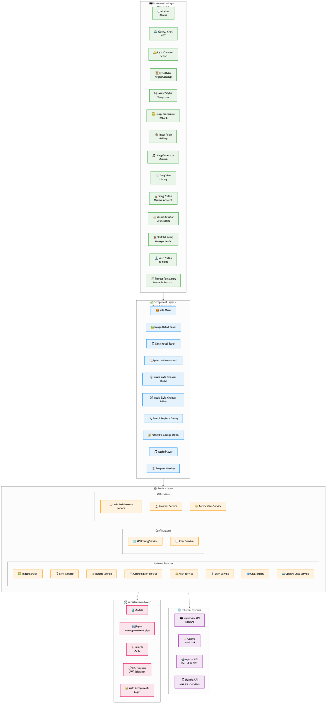

*Figure 5.2.1: Angular Project Structure - Components, services and modules of the frontend*

- **Technology**: Angular 18.2.13 + TypeScript + SCSS + Angular Material
- **Structure**:
  ```
  src/app/
  ├── components/    # Shared Components
  │   └── lyric-architect-modal/  # Song architecture builder with drag & drop
  ├── pages/         # Feature Pages
  │   ├── ai-chat/            # AI Chat conversation interface
  │   ├── lyric-creation/     # Lyric editor with section-based editing & AI tools
  │   ├── song-sketch-creator/  # Create/edit song sketches
  │   ├── song-sketch-library/  # Manage song sketch library
  │   ├── image-generator/    # UI for image generation
  │   ├── image-view/         # Display of generated images
  │   ├── song-generator/     # UI for music generation
  │   ├── song-view/          # Display of generated songs
  │   ├── song-profile/       # Mureka account information
  │   ├── user-profile/       # User profile page
  │   └── prompt-templates/   # Template management for prompts
  ├── services/      # API Services & Business Logic
  │   ├── business/           # ConversationService, SketchService, SongService
  │   ├── config/             # ChatService, ApiConfigService
  │   └── lyric-architecture.service.ts  # Song structure management & persistence
  ├── models/        # TypeScript Interfaces & Models
  │   ├── conversation.model.ts  # Conversation, Message, OllamaModel
  │   └── lyric-architecture.model.ts  # SongSection, SongSectionItem, Architecture config
  ├── pipes/         # Custom Angular Pipes
  │   └── message-content.pipe.ts  # Markdown & link formatting
  ├── guards/        # Route Guards
  ├── interceptors/  # HTTP Interceptors
  └── auth/          # Authentication Logic
  ```
- **Services**: API integration, configuration, prompt management, notifications
- **Shared Components**: Header, footer, detail panels, audio player, progress overlay
- **Dependencies**: Angular Material, RxJS, ngx-cookie-service, compromise, ngx-translate
- **Build**: `npm run build:prod` → Deployment to `forwardproxy/html/aiwebui`

##### 5.2.1.1 Internationalization (i18n)

**Technology**: ngx-translate with JSON translation files

**Supported Languages**:
- `en` - English (default)
- `de` - Deutsch (German)

**Translation Files Location**:
```
src/assets/i18n/
├── en.json  # English translations
└── de.json  # German translations
```

**Key Structure** (Hierarchical, max 3 levels):
```json
{
  "featureName": {
    "subsection": {
      "key": "Translated Text"
    }
  }
}
```

**Adding New Translations:**

1. **Add Translation Keys** to both `en.json` and `de.json`:
   ```json
   {
     "myFeature": {
       "title": "My Feature Title",
       "buttons": {
         "save": "Save",
         "cancel": "Cancel"
       },
       "errors": {
         "required": "{{field}} is required"
       }
     }
   }
   ```

2. **Import TranslateModule** in your component:
   ```typescript
   import { TranslateModule, TranslateService } from '@ngx-translate/core';

   @Component({
     standalone: true,
     imports: [TranslateModule, /* other imports */]
   })
   ```

3. **Inject TranslateService** (if needed in TypeScript):
   ```typescript
   private translate = inject(TranslateService);

   // Usage example
   const msg = this.translate.instant('myFeature.errors.required',
     { field: 'Name' }
   );
   ```

4. **Use in Templates**:
   ```html
   <!-- Simple translation -->
   <h1>{{ 'myFeature.title' | translate }}</h1>

   <!-- With parameters -->
   <p>{{ 'myFeature.errors.required' | translate:{field: 'Email'} }}</p>

   <!-- In attributes -->
   <input [placeholder]="'myFeature.placeholder' | translate">
   ```

**Best Practices**:
- ❌ DON'T hardcode UI text strings
- ❌ DON'T use flat keys (`buttonSave` instead of `common.buttons.save`)
- ❌ DON'T forget to update BOTH `en.json` AND `de.json`
- ❌ DON'T nest deeper than 3 levels
- ✅ DO use feature-grouped hierarchical keys
- ✅ DO provide parameter placeholders for dynamic content (`{{variable}}`)
- ✅ DO test language switching (User Profile → Settings → Language)

**Existing Translation Categories**:
- `common.*` - Shared UI elements (buttons, labels, etc.)
- `chat.*` - AI Chat interface
- `lyricCreation.*` - Lyric editor and section-based editing (40+ keys)
- `songSketch.*` - Song sketch library and creator (50+ keys)
- `imageGenerator.*` - Image generation page
- `imageView.*` - Image gallery and details
- `songGenerator.*` - Song generation page (50+ keys)
- `songView.*` - Song gallery and details
- `userProfile.*` - User profile and settings (35+ keys)
- `nav.*` - Navigation menu items
- `errors.*` - Global error messages

**Language Switching**:
Users can change the language in **User Profile → Settings → Language**. The selection is persisted in `UserSettings` and automatically applied on app startup.

#### 5.2.2 aiproxysrv (Backend API)
- **Technology**: Python 3.12.12 + FastAPI + SQLAlchemy + Pydantic
- **Struktur**:
  ```
  src/
  ├── api/           # API Layer (Business Logic & Routing)
  │   ├── controllers/        # SketchController, ConversationController, ChatController
  │   └── routes/             # sketch_routes, conversation_routes, chat_routes
  ├── business/      # Core Business Logic Services
  ├── db/            # Models & Database Connection
  │   ├── models.py           # SongSketch, Song, Conversation, Message models
  │   ├── sketch_service.py   # Sketch CRUD operations
  │   └── song_service.py     # Song CRUD operations
  ├── schemas/       # Pydantic Data Schemas
  │   ├── sketch_schemas.py   # SketchCreate, SketchUpdate, SketchResponse
  │   └── conversation_schemas.py  # Request/Response schemas
  ├── celery_app/    # Async Processing (Mureka API)
  ├── config/        # Configuration (reads .env)
  ├── utils/         # Utility Functions
  ├── mureka/        # Mureka Integration Functions
  ├── alembic/       # DB Migrations
  ├── server.py      # Dev Server (PyCharm)
  ├── wsgi.py        # Prod Entry (Gunicorn)
  └── worker.py      # Celery Worker
  ```

#### 5.2.3 aitestmock (Test Mock Server)
- **Technology**: Python Flask
- **Purpose**: Mock server for OpenAI and Mureka APIs to reduce costs in development/testing
- **Structure**:
  ```
  src/           # Source Code
  data/          # JSON Response Templates
  static/        # Mock Images, Audio Files (FLAC/MP3/ZIP)
  ```
- **Test Scenarios**:
  - **Image Generation**: Prompt with "0001" → Success, "0002" → Invalid Token Error
  - **Song Generation**: Lyrics with "0001" → Success, "0002" → Invalid Token, "0003" → Generation Failed
  - **Timing**: Style-Prompt "30s" → 30 seconds sync duration

#### 5.2.4 forwardproxy (Nginx)
- **Technology**: Nginx 1.23.3
- **Functions**:
  - HTTPS termination (TLS 1.3)
  - Rate limiting (5req/s)
  - Static file serving
  - API proxy to aiproxysrv:5050

---

## 6. Runtime View

### 6.1 Image Generation (Synchronous)

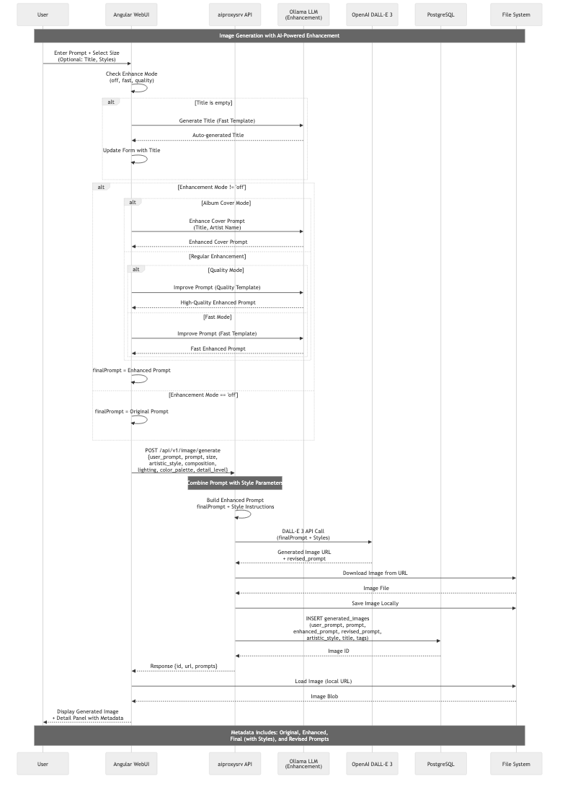

*Figure 6.1: Image Generation (Synchronous) - Sequence diagram of the image generation process*

### 6.2 Music Generation (Asynchronous)

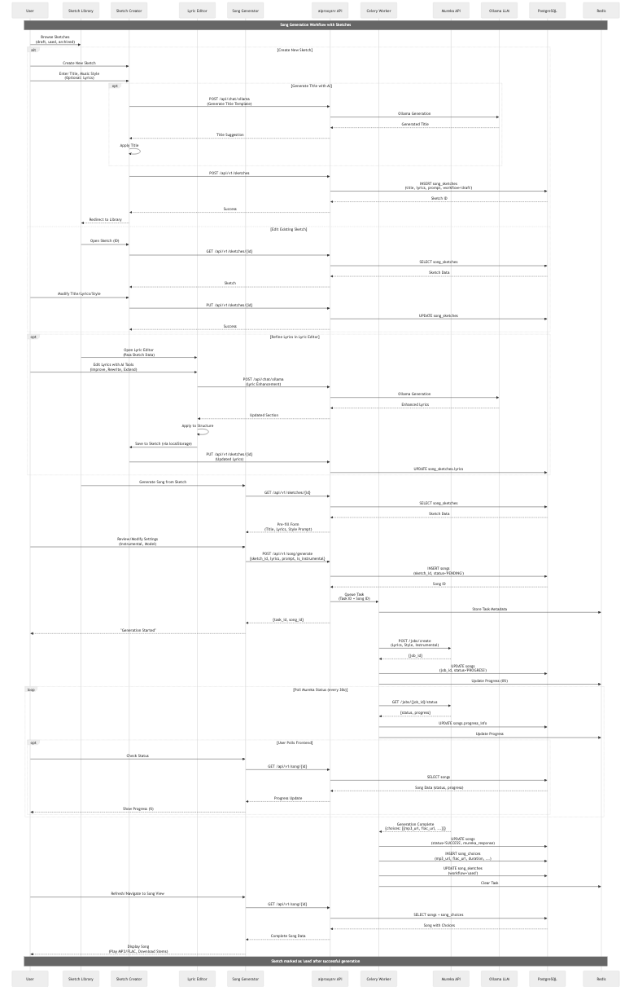

*Figure 6.2: Music Generation (Asynchronous) - Sequence diagram of the asynchronous music generation process*

### 6.3 AI Chat Conversation (Persistent)

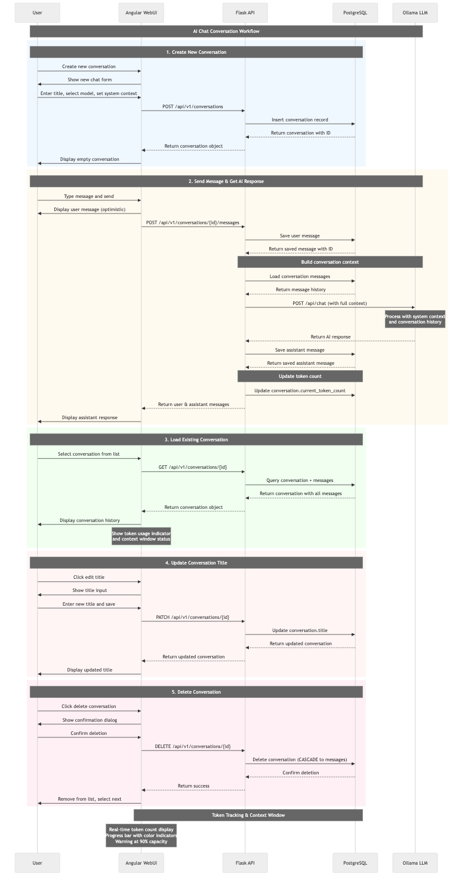

*Figure 6.3: AI Chat Conversation (Persistent) - Sequence diagram of the AI chat conversation workflow with persistent history*

**Key Features:**
- **Persistent Conversations**: All conversations and messages stored in PostgreSQL
- **Context Management**: System context defines AI behavior per conversation
- **Token Tracking**: Real-time monitoring of context window usage with visual indicators
- **Multi-Model Support**: Dynamic selection of Ollama models (llama3.2:3b, mistral, etc.)
- **Optimistic UI**: Immediate message display for better UX
- **Message History**: Full conversation context sent to Ollama for coherent responses
- **CRUD Operations**: Create, read, update (title), delete conversations
- **Markdown Support**: Messages rendered with markdown formatting and clickable links

### 6.4 Lyric Creation Workflow

**Overview**: The Lyric Creation Editor provides a comprehensive songwriting tool with AI-powered assistance for creating, structuring, and refining song lyrics.

**Key Components:**

1. **Lyric Editor Page** (`lyric-creation.component.ts`)
   - Main editing interface with textarea and toolbar
   - Auto-save integration with song generator (localStorage)
   - Character counter and visual feedback
   - Text tools dropdown for structure operations

2. **Architecture Builder Modal** (`lyric-architect-modal.component.ts`)
   - Visual song structure designer with drag & drop
   - Available sections: INTRO, VERSE, PRE_CHORUS, CHORUS, BRIDGE, OUTRO
   - Section reordering and dynamic verse numbering
   - Persistence in localStorage via `LyricArchitectureService`

3. **Section Editor Mode**
   - Split-view interface for section-by-section editing
   - Active section highlighting with navigation
   - Per-section AI operations (improve, rewrite, extend)
   - Full context awareness for coherent improvements

**Workflow Steps:**

1. **Text Input**
   - User enters or pastes raw lyric text
   - Auto-save to localStorage on every change
   - Character count displayed in real-time

2. **Architecture Definition**
   - User opens architecture builder modal
   - Drags sections from palette to structure list
   - Reorders sections via drag & drop
   - Saves architecture (e.g., "VERSE1 - CHORUS - VERSE2 - CHORUS - BRIDGE - CHORUS")

3. **Structure Application**
   - User clicks "Apply Structure" in text tools
   - System splits text into paragraphs (separated by blank lines)
   - Maps paragraphs 1:1 to architecture sections
   - Applies Markdown bold labels: `**Verse1**\nLyric text...`

4. **Section-Based Editing** (Optional)
   - User activates Section Editor mode
   - System parses structured lyrics into section objects
   - Split-view: section list (left) + active section editor (right)
   - User selects section to edit

5. **AI-Powered Improvements**
   - **Improve Section**: Ollama analyzes section in full song context, suggests improvements
   - **Rewrite Section**: Complete rewrite while maintaining theme and style
   - **Extend Section**: Adds additional lines (e.g., +4 lines) to section

6. **Text Tools**
   - **Cleanup**: Removes trailing spaces, normalizes characters, fixes blank lines
   - **Undo**: Reverts last cleanup or structure application
   - **Rebuild Architecture**: Reverse-engineers architecture from structured lyrics

7. **Integration with Song Generator**
   - Lyrics persist in localStorage under song generator key
   - User navigates to Song Generator page
   - Lyrics pre-filled, ready for Mureka generation

**Technical Details:**

- **AI Integration**: All AI operations use `ChatService` with prompt templates (category: "lyrics")
- **State Management**: Local component state with undo buffers (`lastCleanupState`, `lastStructureState`, `lastSectionState`)
- **Parsing Logic**: Regex-based section detection supports both `**Label**` and `Label:` formats
- **Architecture Storage**: JSON in localStorage with `LyricArchitectureConfig` model
- **Performance**: Progress overlay with `ProgressService` for all AI operations
- **Internationalization**: Full i18n support via `lyricCreation.*` translation keys

**User Experience Flow:**

```
[Lyric Editor] → Enter Text → [Architecture Modal] → Define Structure →
[Apply Structure] → Structured Lyrics → [Section Editor] →
Edit Individual Sections → [AI Tools] → Improve/Rewrite/Extend →
[Apply & Save] → [Song Generator] → Generate Song
```

### 6.5 Lyric Parsing Rules Engine

**Overview**: The Lyric Parsing Rules Engine provides configurable regex-based text processing for lyric cleanup and section detection. Rules are stored in the database and dynamically applied without hardcoded logic.

**Problem Statement:**

When storing regex replacement strings in a database, Python and JSON can corrupt special characters like newlines (`\n`) through string interpretation:

```python
# ❌ PROBLEM: Python interprets escape sequences
replacement = ",\n"  # Python converts to: Comma + Newline (2 bytes: 0x2C 0x0A)
# → DB stores: Binary newline (encoding-dependent)
# → JSON transfer: May escape or corrupt data
# → Frontend receives: Inconsistent results
```

**Why Pattern Doesn't Need Base64:**

```python
# Pattern uses raw strings and RegEx engine interpretation
pattern = r"\n{3,}"  # Stored as: \ n { 3 , } (literal characters)
# → DB: \n{3,} (literal)
# → Frontend: new RegExp(pattern)
# → **RegEx Engine** interprets "\n" as Newline ✅
```

**Why Replacement DOES Need Base64:**

```javascript
// JavaScript String.replace() does NOT interpret escape sequences
const replacement = "\\n\\n";  // Literal: Backslash-n-Backslash-n (4 chars)
lyrics.replace(regex, replacement);  // Copies "\\n\\n" literally ❌
// Result: Text contains literal \n instead of newlines!
```

**Solution: Base64 Encoding as Safe Container:**

```
User Input → API → Base64 Encode → DB Storage → API → Base64 Decode → Frontend
Plain Text       "CgoK" (ASCII)        Plain Text (transparent)
```

**Technical Implementation:**

1. **Backend Controller** (`lyric_parsing_rule_controller.py`):
   - `create_rule()`: Encodes `replacement` to Base64 before DB insert
   - `update_rule()`: Encodes `replacement` if present in update payload
   - `get_all_rules()`: Decodes `replacement` from Base64 before returning
   - `get_rule_by_id()`: Decodes `replacement` from Base64 before returning

2. **Database Storage** (`lyric_parsing_rules` table):
   - `pattern`: Raw string (literal `\n` for RegEx engine)
   - `replacement`: **Base64-encoded** (e.g., `"LA0K"` for `",\n"`)

3. **Frontend** (transparent):
   - Receives decoded plain text from API
   - Applies directly: `lyrics.replace(regex, rule.replacement)`
   - No Base64 handling needed - completely transparent

4. **Migration** (`234ea0f4b6c3_base64_encode_lyric_parsing_rule_replacements.py`):
   - Converts all existing `replacement` values to Base64
   - Backward-compatible: Skips already encoded values
   - Downgrade support for rollback

**Why This Approach:**

| Issue | Raw String | Normal String | Base64 |
|-------|-----------|---------------|--------|
| Python Interpretation | ❌ Literal `\n` (no newline) | ❌ Interpreted (corrupted) | ✅ ASCII-safe |
| DB Storage | ⚠️ Depends on encoding | ⚠️ Binary data | ✅ Text (UTF-8) |
| JSON Transfer | ⚠️ Escape issues | ⚠️ Escape issues | ✅ No escaping |
| Frontend Usage | ❌ Literal `\n` | ⚠️ Inconsistent | ✅ Plain text |

**Key Insight:**

The fundamental difference is that **RegEx patterns have an interpreter (the RegEx engine)**, but **replacement strings do not** - they are copied literally. Therefore:

- **Pattern**: Raw string OK → RegEx engine interprets `\n` later
- **Replacement**: Base64 required → No interpreter, needs real newline

**Example Workflow:**

1. User creates rule in frontend: `",\n"` (plain text input)
2. API receives: `",\n"`
3. Controller encodes: `base64_encode(",\n")` → `"LA0K"`
4. DB stores: `"LA0K"`
5. Frontend requests rules
6. Controller decodes: `base64_decode("LA0K")` → `",\n"`
7. Frontend receives: `",\n"` (transparent!)
8. Applies: `lyrics.replace(/,/g, ",\n")` ✅ Works!

**Files Changed:**
- `aiproxysrv/src/api/controllers/lyric_parsing_rule_controller.py` - Encode/decode logic
- `aiproxysrv/scripts/seed_lyric_parsing_rules.py` - Base64-encoded seeds
- `aiproxysrv/src/alembic/versions/234ea0f4b6c3_*.py` - Migration
- `aiwebui/src/app/pages/lyric-creation/lyric-creation.component.ts` - Removed hardcoded escapes (4 locations)

---

## 7. Deployment View

### 7.1 Development Environment
```
MacBook Air M4 (32GB RAM)
├── Host macOS
├── PyCharm Pro (ARM64)
├── Python miniconda3 (mac_ki_service env)
├── Docker colima
│   └── PostgreSQL Container (Port 5432)
├── Local Services
│   ├── Flask Dev Server (src/server.py)
│   ├── Celery Worker (src/worker.py)
│   ├── Angular Dev Server (ng serve)
│   └── AI Test Mock Server (aitestmock) - Optional for cost reduction
└── Configuration
    └── .env files with Mock-API URLs instead of real OpenAI/Mureka APIs
```

### 7.2 Production Environment
```
Mac Studio M1 Max (32GB RAM) - IP: 10.0.1.120
├── Host macOS
├── Docker colima
│   ├── webui-network (Bridge)
│   ├── PostgreSQL (Container: postgres)
│   ├── Redis (Container: redis)
│   ├── Celery Worker (Container: celery-worker)
│   │   └── Image: ghcr.io/rwellinger/celery-worker-app:latest
│   ├── API Server (Container: aiproxysrv)
│   │   └── Image: ghcr.io/rwellinger/aiproxysrv-app:latest
│   └── Nginx Proxy (Container: forward-proxy)
│       └── Image: ghcr.io/rwellinger/aiwebui-app:latest (serves Angular app with integrated chat UI)
├── Native Services
│   └── Ollama (Port 11434) - LLM backend for chat conversations
└── Storage
    ├── postgres-data (Volume)
    ├── redis-data (Volume)
    └── images-data (Volume)

All images built via GitHub Actions (Multi-platform: AMD64 + ARM64)

Note: Chat functionality previously provided by Open WebUI is now
integrated directly into the thWelly Toolbox Angular frontend.
```

### 7.3 Network Architecture

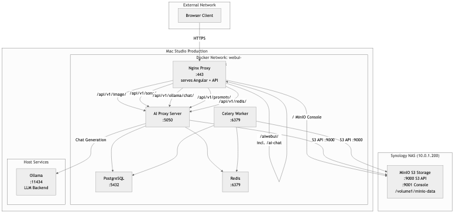

*Figure 7.3: Network Architecture - Production environment with Docker network and host services*

---

## 8. API Documentation

The complete API documentation is automatically generated and always available up-to-date:

- **Swagger UI**: `http://localhost:5050/api/docs/` (interactive documentation)
- **OpenAPI JSON**: `http://localhost:5050/api/openapi.json`
- **OpenAPI YAML**: `http://localhost:5050/api/openapi.yaml`

The documentation is automatically generated from the Python code (code-first approach) and is therefore always in sync with the implementation.

---

## 9. Deployment Diagrams

### 9.1 Development Deployment

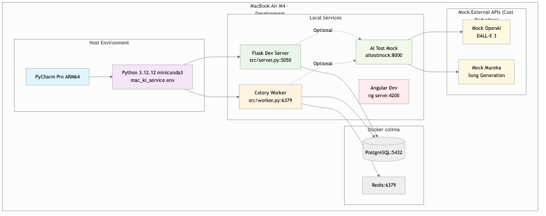

*Figure 9.1: Development Deployment - Local development environment with mock services*

### 9.2 Production Deployment

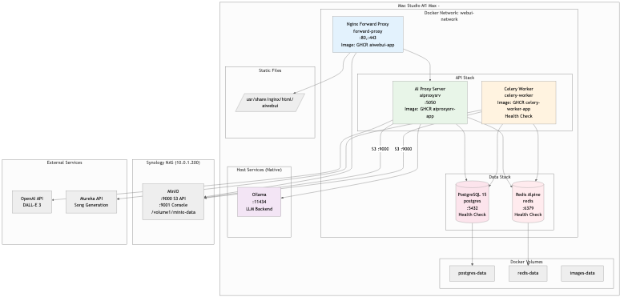

*Figure 9.2: Production Deployment - Complete Docker-based production environment*

### 9.3 Container Orchestration

```yaml
# Simplified docker-compose.yml structure
services:
  postgres:
    image: postgres:15-alpine
    ports: ["5432:5432"]
    volumes: [postgres-data:/var/lib/postgresql/data]
    healthcheck: pg_isready

  redis:
    image: redis:alpine
    ports: ["6379:6379"]
    volumes: [redis-data:/data]
    healthcheck: redis-cli ping

  celery-worker:
    image: ghcr.io/rwellinger/celery-worker-app:latest  # Pre-built from GitHub Actions
    depends_on: [postgres, redis]
    environment:
      - DATABASE_URL
      - REDIS_URL
      - MUREKA_API_KEY

  aiproxy-app:
    image: ghcr.io/rwellinger/aiproxysrv-app:latest  # Pre-built from GitHub Actions
    ports: ["5050:8000"]
    depends_on: [postgres, celery-worker]
    volumes: [images-data:/images]
    environment:
      - DATABASE_URL
      - REDIS_URL
      - OPENAI_API_KEY

  nginx:
    image: ghcr.io/rwellinger/aiwebui-app:latest  # Pre-built Angular app with Nginx
    ports: ["80:80", "443:443"]
    volumes:
      - ./certs:/etc/nginx/certs:ro
      - ./nginx/nginx.conf:/etc/nginx/nginx.conf:ro

# All images are multi-platform (AMD64 + ARM64)
# Built automatically via GitHub Actions on version tags
# Workflow: .github/workflows/docker-build.yml
```

---

## 10. Key Processes

### 10.1 Song Generation Workflow

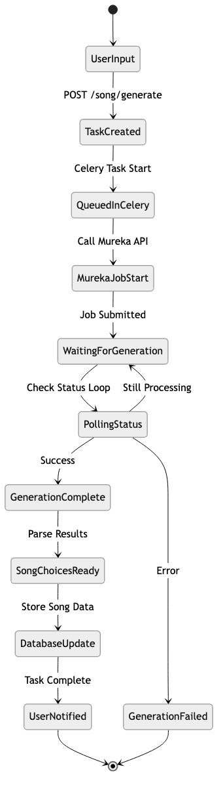

*Figure 10.1: Song Generation Workflow - State diagram of the complete song generation process*

### 10.2 Error Handling & Retry Logic

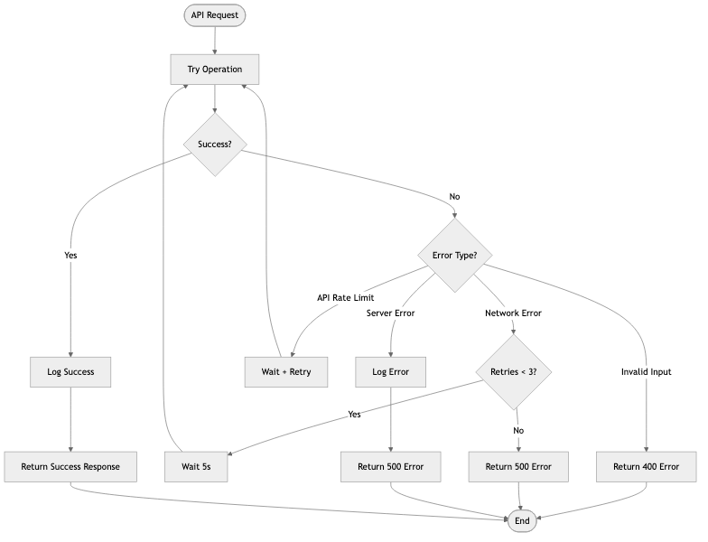

*Figure 10.2: Error Handling & Retry Logic - Flow diagram of error handling and retry mechanisms*

### 10.3 Health Check Process


*Figure 10.3: Health Check Process - Monitoring and supervision of all services*

### 10.4 Backup & Recovery Process

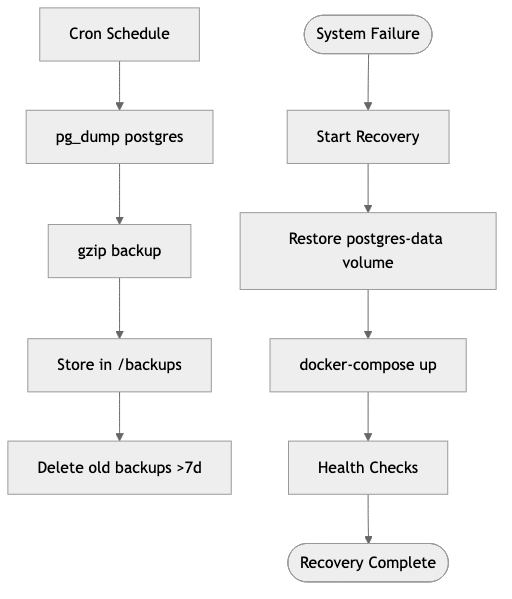

*Figure 10.4: Backup & Recovery Process - Data backup and restoration*

---

## 11. Quality Requirements

### 11.1 Performance
- **API Response Time**: < 200ms for standard requests
- **Image Generation**: < 30s for DALL-E 3 calls
- **Song Generation**: 2-5 minutes (depending on Mureka)
- **AI Chat Response**: 1-5 seconds (depending on Ollama model and context size)
- **Lyric AI Operations**: 2-8 seconds (improve/rewrite/extend via Ollama)
- **Concurrent Users**: 1 (personal use)

### 11.2 Security
- **HTTPS**: TLS 1.3 encryption
- **Rate Limiting**: 5 req/s via Nginx
- **API Keys**: Secure storage in .env files
- **CORS**: Configured for frontend domain

### 11.3 Monitoring
- **Health Checks**: All services every 30s
- **Logging**: Structured logs via Python logging
- **Alerts**: Container restart on health check failures

---

## 12. Glossary

| Term           | Definition                                                                      |
| -------------- | ------------------------------------------------------------------------------- |
| **DALL-E 3**   | OpenAI's image generation AI                                                    |
| **Mureka**     | Song generation API service                                                     |
| **Celery**     | Python task queue for asynchronous processing                                   |
| **Colima**     | Container runtime for macOS (Docker alternative)                                |
| **Alembic**    | Database migration tool for SQLAlchemy                                          |
| **Task ID**    | Celery task identifier for async operations                                     |
| **Job ID**     | Mureka job identifier for song generation                                       |
| **Choice**     | Single music variant from Mureka (usually 2 per generation)                     |
| **Ollama**     | Open-source LLM runtime for local chat generation (10.0.1.120:11434)           |
| **Chat API**   | Ollama-based text generation for conversational AI with 4 endpoints             |
| **Conversation** | Persistent chat session with AI model, system context, and token tracking     |
| **Message**    | Individual user or assistant message within a conversation                      |
| **System Context** | Custom instructions that define AI behavior for a conversation                |
| **Token Tracking** | Real-time monitoring of context window usage with visual indicators          |
| **AI Magic Functions** | Template-based intelligent prompt enhancement via prompt_templates       |
| **Prompt Templates** | Reusable prompt templates with pre/post conditions and AI parameters       |
| **Template Processing** | Automatic prompt optimization with model, temperature, max_tokens        |
| **Settings**   | Frontend component for system configuration and user preferences                |
| **Entity-Relationship** | Database schema with 10 tables (songs, sketches, conversations, users, etc.) |
| **aitestmock** | Mock server for OpenAI and Mureka APIs for cost reduction in development/testing |
| **Lyric Editor** | Integrated songwriting tool with section-based editing and AI assistance        |
| **Song Architecture** | Structured song layout definition (INTRO, VERSE, CHORUS, BRIDGE, OUTRO, etc.) |
| **Section Editor** | Split-view interface for editing individual lyric sections with AI tools        |
| **Lyric Architecture Service** | Frontend service managing song structure persistence in localStorage    |
| **Text Tools** | Cleanup, structure application, and undo operations for lyric text              |
| **Song Sketch** | Pre-generation song concept with title, lyrics, music style prompt, and tags    |
| **Sketch Library** | Master-detail view for managing song sketches with search and filtering         |
| **Sketch Creator** | Form interface for creating/editing song sketches with AI title generation      |
| **Sketch Workflow** | Organizational state: draft (new), used (generated), archived (inactive)        |

---

## 13. Database Schema

### 13.1 Entity-Relationship Diagram

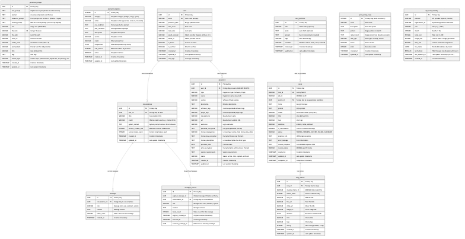

*Figure 13.1: Database Schema - Entity-relationship diagram of all tables and relationships*

### 13.2 Table Overview

#### 13.2.1 songs
**Purpose**: Main table for song generation and management

| Column | Type | Description |
|--------|-----|-------------|
| `id` | UUID | Primary Key |
| `task_id` | VARCHAR(255) | Celery Task ID (unique) |
| `job_id` | VARCHAR(255) | MUREKA Job ID |
| `sketch_id` | UUID | Foreign Key to song_sketches.id (nullable) |
| `lyrics` | TEXT | Song text input |
| `prompt` | TEXT | Style prompt for generation |
| `model` | VARCHAR(100) | Generation model (default: "auto") |
| `title` | VARCHAR(500) | User-defined title |
| `tags` | VARCHAR(1000) | User-defined tags |
| `workflow` | VARCHAR(50) | Status: onWork, inUse, notUsed |
| `is_instrumental` | BOOLEAN | True for instrumental songs |
| `status` | VARCHAR(50) | PENDING, PROGRESS, SUCCESS, FAILURE, CANCELLED |
| `progress_info` | TEXT | JSON progress details |
| `error_message` | TEXT | Error information |
| `mureka_response` | TEXT | Complete MUREKA response (JSON) |
| `mureka_status` | VARCHAR(100) | MUREKA-specific status |
| `created_at` | TIMESTAMP | Creation timestamp |
| `updated_at` | TIMESTAMP | Last update |
| `completed_at` | TIMESTAMP | Completion timestamp |

#### 13.2.2 song_choices
**Purpose**: Individual song variants from MUREKA (1:N to songs)

| Column | Type | Description |
|--------|-----|-------------|
| `id` | UUID | Primary Key |
| `song_id` | UUID | Foreign Key to songs.id |
| `mureka_choice_id` | VARCHAR(255) | MUREKA Choice Identifier |
| `choice_index` | INTEGER | Index in choices array |
| `mp3_url` | VARCHAR(1000) | MP3 file URL |
| `flac_url` | VARCHAR(1000) | FLAC file URL |
| `video_url` | VARCHAR(1000) | Video file URL |
| `image_url` | VARCHAR(1000) | Cover image URL |
| `duration` | FLOAT | Duration in milliseconds |
| `title` | VARCHAR(500) | Choice title |
| `tags` | VARCHAR(1000) | Choice tags |
| `rating` | INTEGER | Rating (0=thumbs down, 1=thumbs up) |
| `created_at` | TIMESTAMP | Creation timestamp |
| `updated_at` | TIMESTAMP | Last update |

#### 13.2.3 song_sketches
**Purpose**: Song concept/draft management before generation (1:N to songs)

| Column | Type | Description |
|--------|-----|-------------|
| `id` | UUID | Primary Key |
| `title` | VARCHAR(500) | Sketch title (optional) |
| `lyrics` | TEXT | Lyric draft (optional) |
| `prompt` | TEXT | Music style prompt (required) |
| `tags` | VARCHAR(1000) | User-defined tags |
| `workflow` | VARCHAR(50) | Workflow status: draft, used, archived |
| `created_at` | TIMESTAMP | Creation timestamp |
| `updated_at` | TIMESTAMP | Last update |

#### 13.2.4 generated_images
**Purpose**: Generated images and metadata

| Column | Type | Description |
|--------|-----|-------------|
| `id` | UUID | Primary Key |
| `prompt` | TEXT | Generation prompt |
| `size` | VARCHAR(20) | Image size (e.g. "1024x1024") |
| `filename` | VARCHAR(255) | Unique filename |
| `file_path` | VARCHAR(500) | Local file path |
| `local_url` | VARCHAR(500) | Local access URL |
| `model_used` | VARCHAR(100) | Generation model used |
| `prompt_hash` | VARCHAR(32) | Prompt hash for deduplication |
| `title` | VARCHAR(255) | User-defined title |
| `tags` | TEXT | User-defined tags |
| `created_at` | TIMESTAMP | Creation timestamp |
| `updated_at` | TIMESTAMP | Last update |

#### 13.2.5 prompt_templates
**Purpose**: AI prompt templates for various categories and actions

| Column | Type | Description |
|--------|-----|-------------|
| `id` | INTEGER | Primary Key |
| `category` | VARCHAR(50) | Template category (images, songs, lyrics) |
| `action` | VARCHAR(50) | Template action (generate, enhance, translate) |
| `pre_condition` | TEXT | Text before the prompt |
| `post_condition` | TEXT | Text after the prompt |
| `description` | TEXT | Template description |
| `version` | VARCHAR(10) | Template version |
| `model` | VARCHAR(50) | Ollama model hint |
| `temperature` | FLOAT | Ollama temperature (0.0-2.0) |
| `max_tokens` | INTEGER | Maximum token count |
| `active` | BOOLEAN | Template is active |
| `created_at` | TIMESTAMP | Creation timestamp |
| `updated_at` | TIMESTAMP | Last update |

#### 13.2.6 conversations
**Purpose**: AI Chat conversations with persistent context

| Column | Type | Description |
|--------|-----|-------------|
| `id` | UUID | Primary Key |
| `title` | VARCHAR(500) | Conversation title |
| `model` | VARCHAR(100) | Ollama model used (e.g., llama3.2:3b) |
| `system_context` | TEXT | System context for AI behavior |
| `context_window_size` | INTEGER | Maximum context window size |
| `current_token_count` | INTEGER | Current token usage |
| `created_at` | TIMESTAMP | Creation timestamp |
| `updated_at` | TIMESTAMP | Last update |

#### 13.2.7 messages
**Purpose**: Individual messages within conversations (1:N to conversations)

| Column | Type | Description |
|--------|-----|-------------|
| `id` | UUID | Primary Key |
| `conversation_id` | UUID | Foreign Key to conversations.id |
| `role` | VARCHAR(20) | Message role: user, assistant, system |
| `content` | TEXT | Message content |
| `token_count` | INTEGER | Token count for this message |
| `created_at` | TIMESTAMP | Creation timestamp |

#### 13.2.8 messages_archive
**Purpose**: Archived messages from conversation compression (1:N to conversations)

| Column | Type | Description |
|--------|-----|-------------|
| `id` | UUID | Primary Key |
| `original_message_id` | UUID | Original message ID before archiving |
| `conversation_id` | UUID | Foreign Key to conversations.id |
| `role` | VARCHAR(50) | Message role: user, assistant, system |
| `content` | TEXT | Message content |
| `token_count` | INTEGER | Token count for this message |
| `original_created_at` | TIMESTAMP | Original creation timestamp |
| `archived_at` | TIMESTAMP | Archiving timestamp |
| `summary_message_id` | UUID | Reference to summary message (if applicable) |

#### 13.2.9 users
**Purpose**: User accounts and authentication

| Column | Type | Description |
|--------|-----|-------------|
| `id` | UUID | Primary Key |
| `email` | VARCHAR(255) | User email (unique) |
| `password_hash` | VARCHAR(255) | BCrypt password hash |
| `first_name` | VARCHAR(100) | First name |
| `last_name` | VARCHAR(100) | Last name |
| `oauth_provider` | VARCHAR(50) | OAuth provider (Google, GitHub, etc.) |
| `oauth_id` | VARCHAR(255) | OAuth provider user ID |
| `is_active` | BOOLEAN | Account is active |
| `is_verified` | BOOLEAN | Email is verified |
| `created_at` | TIMESTAMP | Creation timestamp |
| `updated_at` | TIMESTAMP | Last update timestamp |
| `last_login` | TIMESTAMP | Last login timestamp |

#### 13.2.10 lyric_parsing_rules
**Purpose**: Configurable regex-based rules for lyric cleanup and section detection

| Column | Type | Description |
|--------|-----|-------------|
| `id` | INTEGER | Primary Key (auto-increment) |
| `name` | VARCHAR(100) | Rule name |
| `description` | TEXT | Rule description |
| `pattern` | TEXT | Regex pattern to match |
| `replacement` | TEXT | Replacement text |
| `rule_type` | VARCHAR(50) | Rule type: cleanup, section |
| `active` | BOOLEAN | Rule is active |
| `order` | INTEGER | Execution order |
| `created_at` | TIMESTAMP | Creation timestamp |
| `updated_at` | TIMESTAMP | Last update timestamp |

### 13.3 Relationships and Constraints

- **song_sketches ↔ songs**: 1:N relationship (one sketch can be used for multiple songs)
- **songs ↔ song_choices**: 1:N relationship with CASCADE DELETE
- **conversations ↔ messages**: 1:N relationship with CASCADE DELETE
- **conversations ↔ messages_archive**: 1:N relationship with CASCADE DELETE
- **users ↔ conversations**: 1:N relationship (user_id references users.id)
- **Unique Constraints**: `songs.task_id`, `generated_images.filename`, `users.email`
- **Indexes**:
  - Performance: `task_id`, `job_id`, `song_id`, `sketch_id`, `conversation_id`, `original_message_id`
  - Lookup: `users.email`, `lyric_parsing_rules.active`, `lyric_parsing_rules.order`, `song_sketches.workflow`
- **Foreign Keys**:
  - `songs.sketch_id` → `song_sketches.id` (nullable)
  - `song_choices.song_id` → `songs.id`
  - `messages.conversation_id` → `conversations.id`
  - `messages_archive.conversation_id` → `conversations.id`
  - `conversations.user_id` → `users.id`

### 13.4 Migration and Maintenance

**Migration Commands:**
```bash
# Create new migration
cd src && alembic revision --autogenerate -m "description"

# Apply migrations
cd src && alembic upgrade head

# Check current version
cd src && alembic current
```

**Important Considerations:**
- UUID as primary keys for better scalability
- JSON fields for flexible metadata storage
- Timestamps for audit trail
- Cascade deletes for data integrity

---

*Document created: 01.09.2025*
*Last updated: 18.10.2025*
*Version: 1.8*
*Author: Rob (rob.wellinger@gmail.com)*
