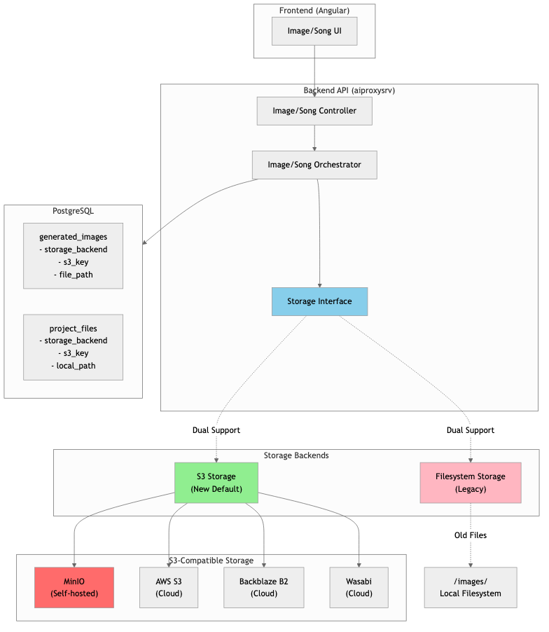
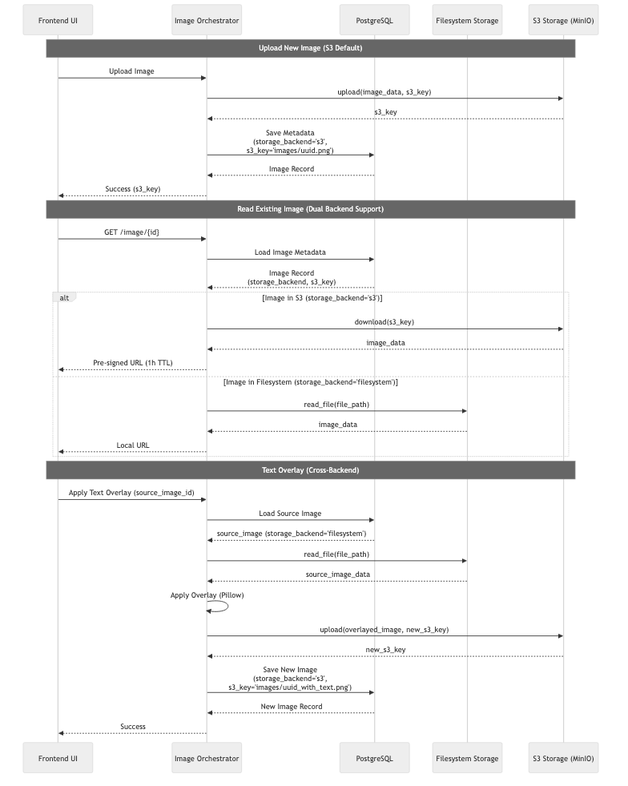

# ARC42 Architecture Documentation - Mac AI Service

## Table of Contents

1. [Introduction and Goals](#1-introduction-and-goals)
   - [1.1 Requirements Overview](#11-requirements-overview)
   - [1.2 Quality Goals](#12-quality-goals)
   - [1.3 Stakeholders](#13-stakeholders)
2. [Constraints](#2-constraints)
   - [2.1 Technical Constraints](#21-technical-constraints)
   - [2.2 Organizational Constraints](#22-organizational-constraints)
3. [Context Boundary](#3-context-boundary)
   - [3.1 Business Context](#31-business-context)
   - [3.2 Technical Context](#32-technical-context)
4. [Solution Strategy](#4-solution-strategy)
   - [4.1 Architecture Approach](#41-architecture-approach)
   - [4.2 Technology Stack](#42-technology-stack)
5. [Building Block View](#5-building-block-view)
   - [5.1 System Overview](#51-system-overview)
   - [5.2 Component Details](#52-component-details)
     - [5.2.1.1 Internationalization (i18n)](#5211-internationalization-i18n)
6. [Runtime View](#6-runtime-view)
   - [6.1 Image Generation (Synchronous)](#61-image-generation-synchronous)
   - [6.2 Music Generation (Asynchronous)](#62-music-generation-asynchronous)
   - [6.3 AI Chat Conversation (Persistent)](#63-ai-chat-conversation-persistent)
   - [6.4 Lyric Creation Workflow](#64-lyric-creation-workflow)
   - [6.5 Text Overlay Workflow](#65-text-overlay-workflow)
   - [6.6 S3 Storage Migration (Hybrid Storage Architecture)](#66-s3-storage-migration-hybrid-storage-architecture)
   - [6.7 Lyric Parsing Rules Engine](#67-lyric-parsing-rules-engine)
7. [Deployment View](#7-deployment-view)
   - [7.1 Development Environment](#71-development-environment)
   - [7.2 Production Environment](#72-production-environment)
   - [7.3 Network Architecture](#73-network-architecture)
8. [Architecture Decisions](#8-architecture-decisions)
   - [8.1 3-Layer Architecture (Backend)](#81-3-layer-architecture-backend)
   - [8.2 API Routing & Security](#82-api-routing--security)
   - [8.3 Template-Driven AI Integration](#83-template-driven-ai-integration)
   - [8.4 Frontend Patterns](#84-frontend-patterns)
   - [8.5 Code Quality & Testing](#85-code-quality--testing)
   - [8.6 Automated Architecture Validation](#86-automated-architecture-validation)
9. [API Documentation](#9-api-documentation)
10. [Deployment Diagrams](#10-deployment-diagrams)
    - [10.1 Development Deployment](#101-development-deployment)
    - [10.2 Production Deployment](#102-production-deployment)
    - [10.3 Container Orchestration](#103-container-orchestration)
11. [Key Processes](#11-key-processes)
    - [11.1 Song Generation Workflow](#111-song-generation-workflow)
    - [11.2 Error Handling & Retry Logic](#112-error-handling--retry-logic)
    - [11.3 Health Check Process](#113-health-check-process)
    - [11.4 Backup & Recovery Process](#114-backup--recovery-process)
12. [Quality Requirements](#12-quality-requirements)
    - [12.1 Performance](#121-performance)
    - [12.2 Security](#122-security)
    - [12.3 Monitoring](#123-monitoring)
13. [Glossary](#13-glossary)
14. [Database Schema](#14-database-schema)
    - [14.1 Entity-Relationship Diagram](#141-entity-relationship-diagram)
    - [14.2 Table Overview](#142-table-overview)
    - [14.3 Relationships and Constraints](#143-relationships-and-constraints)
    - [14.4 Migration and Maintenance](#144-migration-and-maintenance)

## Figure Index

- [Figure 3.1: Business Context](#31-business-context) - `images/3.1_fachlicher_kontext.png`
- [Figure 5.1: System Overview](#51-system-overview) - `images/5.1_systemuebersicht.png`
- [Figure 5.2.1: Angular Project Structure](#521-aiwebui-frontend) - `images/5.2.1_angular_projektstruktur.png`
- [Figure 6.1: Image Generation (Synchronous)](#61-image-generation-synchronous) - `images/6.1_bildgenerierung.png`
- [Figure 6.2: Music Generation (Asynchronous)](#62-music-generation-asynchronous) - `images/6.2_musikgenerierung.png`
- [Figure 6.3: AI Chat Conversation (Persistent)](#63-ai-chat-conversation-persistent) - `images/6.3_ai_chat_workflow.png`
- [Figure 6.6.1: Storage Migration Architecture](#66-s3-storage-migration-hybrid-storage-architecture) - `images/6.7_storage_migration.png`
- [Figure 6.6.2: S3 Migration Workflow](#66-s3-storage-migration-hybrid-storage-architecture) - `images/6.8_s3_migration_workflow.png`
- [Figure 7.3: Network Architecture](#73-network-architecture) - `images/7.3_netzwerk_architektur.png`
- [Figure 10.1: Development Deployment](#101-development-deployment) - `images/9.1_entwicklungs_deployment.png`
- [Figure 10.2: Production Deployment](#102-production-deployment) - `images/9.2_produktions_deployment.png`
- [Figure 11.1: Song Generation Workflow](#111-song-generation-workflow) - `images/10.1_song_generierung_workflow.png`
- [Figure 11.2: Error Handling & Retry Logic](#112-error-handling--retry-logic) - `images/10.2_error_handling.png`
- [Figure 11.3: Health Check Process](#113-health-check-process) - `images/10.3_health_check.png`
- [Figure 11.4: Backup & Recovery Process](#114-backup--recovery-process) - `images/10.4_backup_recovery.png`
- [Figure 14.1: Database Schema](#141-entity-relationship-diagram) - `images/13_database_schema.png`

---

## 1. Introduction and Goals

### 1.1 Requirements Overview
The Mac AI Service System is a personal AI-based multimedia generation platform offering the following main features:
- **AI Chat Conversations** - Interactive conversational AI via Ollama with persistent conversation history
  - Integrated chat UI as part of thWelly Toolbox (replaced Open WebUI dependency)
  - Direct Ollama integration with full conversation management
- **Lyric Creation Editor** - Professional songwriting tool with AI-powered assistance
  - Section-based editing (Intro, Verse, Pre-Chorus, Chorus, Bridge, Outro)
  - Song architecture builder with drag & drop reordering
  - AI-powered section improvement, rewriting, and extension via Ollama
  - Text tools: cleanup, structure application, section navigation, undo functionality
- **Song Sketch Library** - Organize and develop song ideas before generation
  - Create and manage song sketches (title, lyrics, music style prompt, tags)
  - Workflow management (draft, used, archived)
  - Master-detail view with search and filtering
  - AI-powered title generation
  - Direct integration with Song Generator and Lyric Creator
  - Convert sketches to full songs with one click
- **Equipment Management** - Organize music production software and plugins
  - Master-detail gallery with search, filtering, and pagination
  - Software and plugin inventory tracking
  - Secure credential storage with encrypted passwords and license keys
  - License management (online, iLok, license keys, other)
  - Status tracking (active, trial, expired, archived)
  - Purchase tracking with encrypted price and date
  - Duplicate functionality for quick setup
  - Tagging system for software and plugin organization
- **Image Generation** via DALL-E 3 (OpenAI API)
  - Fast Enhancement Mode: One-click AI-powered prompt optimization via templates
  - Gallery view with filtering, search, and sorting
  - Master-detail layout with responsive design
  - Detail panel showing metadata (original/enhanced/revised prompts)
  - Download and delete functionality
  - **Text Overlay Editor** - Add customizable text to generated images
    - Real-time canvas preview with position markers
    - Title and optional artist text (auto-uppercase, artist prefixed with "BY")
    - Three font styles: Bold (Anton), Elegant (Playfair Display), Light (Roboto)
    - Advanced positioning: 3x3 grid system or custom pixel coordinates
    - Independent color and outline controls for title and artist
    - Composition-based sorting (e.g., album-cover composition prioritized)
    - Non-destructive editing: Creates new image records without modifying originals
    - Metadata storage in database (JSON field: text_overlay_metadata)
  - **Usage Cost Tracking** - Real-time monitoring of OpenAI API costs
    - TTL-based caching (1 hour for current month, forever for historical)
    - Cost categorization by model (DALL-E, GPT, etc.)
    - Monthly and all-time cost aggregation
    - Integration with OpenAI Admin API
    - Display in User Profile page
- **Music Generation** via Mureka API
- **Asynchronous Processing** for time-intensive generation processes
- **Ollama Model Chat** for prompt improvements via prompt templates
- **Web-based User Interface** for easy operation

### 1.2 Quality Goals
| Priority | Quality Goal       | Motivation                                             |
| -------- | ------------------ | ------------------------------------------------------ |
| 1        | **Availability**   | System must be available 24/7 for personal use         |
| 2        | **Performance**    | Fast response times for API calls                      |
| 3        | **Scalability**    | Extension with additional AI services possible         |
| 4        | **Maintainability**| Easy deployment and updates                            |

### 1.3 Stakeholders
- **Robert Wellinger (Developer/User)**: Currently the only user and developer of the system

---

## 2. Constraints

### 2.1 Technical Constraints
- **Hardware**: Apple Silicon (M1 Max, M4) architecture
- **Operating System**: macOS
- **Containerization**: Docker (via colima)
- **Python Version**: Python 3.12.12 with miniconda3
- **Development Environment**: PyCharm Pro (ARM64)

### 2.2 Organizational Constraints
- Personal project (no team development)
- **Repository Separation**: Two separate Git repositories for DEV and PROD environments
  - **mac_ki_service/** - Development repository (source code, CI/CD, builds)
  - **thwelly_ki_app/** - Production repository (deployment configs, secrets, data volumes)
- Development and production environments separated
- .env files not in Git (API keys, passwords)

---

## 3. Context Boundary

### 3.1 Business Context


*Figure 3.1: Business Context - Overview of the main actors and systems*

### 3.2 Technical Context

**External Interfaces:**
- **OpenAI API**: DALL-E 3 for image generation (HTTPS/REST)
- **Mureka API**: Music generation (HTTPS/REST)
- **AI Test Mock**: Mock server for development/testing (HTTP/REST) - Cost reduction

**Internal Interfaces:**
- **Frontend ↔ Backend**: REST API (JSON over HTTPS)
- **Backend ↔ Database**: PostgreSQL (SQL) - Including conversations and messages tables
- **Backend ↔ Cache**: Redis (Key-Value)
- **Backend ↔ Ollama**: AI Chat & Prompt Enhancement (HTTP/REST)
  - Chat Generation (Conversations)
  - Unified Prompt Enhancement (Template-based)

---

## 4. Solution Strategy

### 4.1 Architecture Approach
- **Microservice-oriented**: Separate services for different functions
- **Event-driven**: Asynchronous processing via Celery
- **API-First**: REST API as central interface
- **Containerized**: Docker for consistent deployments
- **3-Tier Architecture**: Strict separation of concerns in backend (Controller → Business → Repository)

#### 4.1.1 Backend 3-Tier Architecture (MANDATORY)

**Layer Separation:**
```
Controller → Business Service → Repository
(HTTP)       (Logic, Testable)  (DB CRUD)
```

**Layer Responsibilities:**

**1. Controller Layer** (`src/api/controllers/*_controller.py`)
- ✅ HTTP request/response handling
- ✅ Input validation (Pydantic)
- ✅ Call business layer
- ❌ NO business logic
- ❌ NO direct DB queries

**2. Business Layer** (`src/business/*_service.py` or `*_transformer.py`)
- ✅ Business logic, calculations, transformations
- ✅ Pure functions (no DB, no file system)
- ✅ **MUST be unit-testable** without mocks
- ❌ NO database queries
- ❌ NO file system operations

**3. Repository Layer** (`src/db/*_service.py`)
- ✅ CRUD operations only
- ✅ SQLAlchemy queries
- ❌ NO business logic
- ❌ NO transformations (use business layer)
- ❌ **NO unit tests** (pure CRUD, not testable without DB)

**Example Implementation (OpenAI Usage Costs):**
```
OpenAICostController (src/api/controllers/openai_cost_controller.py)
  ├─ HTTP endpoints (GET /api/v1/openai/costs/*)
  ├─ JWT authentication (@jwt_required)
  ├─ Calls Business Layer ↓

ApiCostTransformer (src/business/api_cost_transformer.py)
  ├─ Pure functions (unit-tested):
  │   ├─ transform_to_dict() - DB Model → Dict (Decimal → float)
  │   ├─ apply_cost_defaults() - Default values
  │   ├─ validate_cost_data() - Validation
  │   └─ format_all_time_costs() - Formatting
  ├─ Calls Repository Layer ↓

ApiCostService (src/db/api_cost_service.py)
  └─ CRUD operations (no tests):
      ├─ get_cached_month()
      ├─ save_month_costs()
      └─ get_all_time_totals()
```

**Benefits:**
- **Testability**: Business logic 100% unit-testable (pure functions)
- **Maintainability**: Clear separation, easy to refactor
- **Scalability**: Business logic can be reused across controllers
- **Code Review**: Violations easily detectable during PR review

### 4.2 Technology Stack
- **Frontend**: Angular 18.2.13 + TypeScript + Angular Material + SCSS + RxJS
- **Backend**: Python 3.12.12 + FastAPI + SQLAlchemy 2.0 + Pydantic 2.0 + Alembic 1.13
- **Image Processing**: Pillow (PIL) 11.0.0 - Text overlay rendering, font handling, image manipulation
- **Object Storage**: Boto3 + S3-compatible storage (MinIO, AWS S3, Backblaze B2, Wasabi)
- **API Documentation**: OpenAPI/Swagger (auto-generated)
- **Authentication**: PyJWT + BCrypt
- **Async Processing**: Celery 5.4 + Redis 5.0
- **Database**: PostgreSQL 15 + psycopg2-binary
- **Web Server**: Gunicorn (Production), Uvicorn Dev Server (Development)
- **Proxy**: Nginx 1.23.3 (Production)
- **Container**: Docker + Docker Compose (Colima on macOS)
- **Code Quality**: Ruff (linting & formatting), pytest (unit testing)

---

## 5. Building Block View

### 5.1 System Overview


*Figure 5.1: System Overview - Architectural layers and components*

### 5.2 Component Details

#### 5.2.1 aiwebui (Frontend)


*Figure 5.2.1: Angular Project Structure - Components, services and modules of the frontend*

- **Technology**: Angular 18.2.13 + TypeScript + SCSS + Angular Material
- **Structure**:
  ```
  src/app/
  ├── components/    # Shared Components
  │   ├── lyric-architect-modal/  # Song architecture builder with drag & drop
  │   ├── image-detail-panel/     # Image detail view component
  │   ├── song-detail-panel/      # Song detail view component
  │   └── ...
  ├── pages/         # Feature Pages
  │   ├── ai-chat/            # AI Chat conversation interface (Ollama)
  │   ├── openai-chat/        # OpenAI GPT chat interface
  │   ├── lyric-creation/     # Lyric editor with section-based editing & AI tools
  │   ├── lyric-parsing-rules/  # Manage regex-based lyric cleanup rules
  │   ├── song-sketch-creator/  # Create/edit song sketches
  │   ├── song-sketch-library/  # Manage song sketch library
  │   ├── equipment-gallery/  # Equipment master-detail gallery with search & filtering
  │   ├── equipment-editor/   # Equipment create/edit/duplicate
  │   ├── music-style-prompt/   # Music style template management
  │   ├── image-generator/    # Image generation with fast enhancement mode
  │   ├── image-view/         # Image gallery with master-detail layout
  │   ├── text-overlay-editor/  # Add text overlays to generated images
  │   ├── song-generator/     # UI for music generation
  │   ├── song-view/          # Display of generated songs
  │   ├── song-profile/       # Mureka account information
  │   ├── user-profile/       # User profile page
  │   └── prompt-templates/   # Template management for prompts
  ├── services/      # API Services & Business Logic
  │   ├── business/           # ImageService, ConversationService, SketchService, SongService, EquipmentService
  │   ├── config/             # ChatService, ApiConfigService
  │   └── lyric-architecture.service.ts  # Song structure management & persistence
  ├── models/        # TypeScript Interfaces & Models
  │   ├── conversation.model.ts  # Conversation, Message, OllamaModel
  │   ├── equipment.model.ts  # Equipment, EquipmentType, LicenseManagement, EquipmentStatus
  │   └── lyric-architecture.model.ts  # SongSection, SongSectionItem, Architecture config
  ├── pipes/         # Custom Angular Pipes
  │   └── message-content.pipe.ts  # Markdown & link formatting
  ├── guards/        # Route Guards
  ├── interceptors/  # HTTP Interceptors
  └── auth/          # Authentication Logic
  ```
- **Services**: API integration, configuration, prompt management, notifications
- **Shared Components**: Header, footer, detail panels, audio player, progress overlay
- **Dependencies**: Angular Material, RxJS, ngx-cookie-service, compromise, ngx-translate
- **Build**: `npm run build:prod` → Deployment to `forwardproxy/html/aiwebui`

##### 5.2.1.1 Internationalization (i18n)

**Technology**: ngx-translate with JSON translation files

**Supported Languages**:
- `en` - English (default)
- `de` - Deutsch (German)

**Translation Files Location**:
```
src/assets/i18n/
├── en.json  # English translations
└── de.json  # German translations
```

**Key Structure** (Hierarchical, max 3 levels):
```json
{
  "featureName": {
    "subsection": {
      "key": "Translated Text"
    }
  }
}
```

**Adding New Translations:**

1. **Add Translation Keys** to both `en.json` and `de.json`:
   ```json
   {
     "myFeature": {
       "title": "My Feature Title",
       "buttons": {
         "save": "Save",
         "cancel": "Cancel"
       },
       "errors": {
         "required": "{{field}} is required"
       }
     }
   }
   ```

2. **Import TranslateModule** in your component:
   ```typescript
   import { TranslateModule, TranslateService } from '@ngx-translate/core';

   @Component({
     standalone: true,
     imports: [TranslateModule, /* other imports */]
   })
   ```

3. **Inject TranslateService** (if needed in TypeScript):
   ```typescript
   private translate = inject(TranslateService);

   // Usage example
   const msg = this.translate.instant('myFeature.errors.required',
     { field: 'Name' }
   );
   ```

4. **Use in Templates**:
   ```html
   <!-- Simple translation -->
   <h1>{{ 'myFeature.title' | translate }}</h1>

   <!-- With parameters -->
   <p>{{ 'myFeature.errors.required' | translate:{field: 'Email'} }}</p>

   <!-- In attributes -->
   <input [placeholder]="'myFeature.placeholder' | translate">
   ```

**Best Practices**:
- ❌ DON'T hardcode UI text strings
- ❌ DON'T use flat keys (`buttonSave` instead of `common.buttons.save`)
- ❌ DON'T forget to update BOTH `en.json` AND `de.json`
- ❌ DON'T nest deeper than 3 levels
- ✅ DO use feature-grouped hierarchical keys
- ✅ DO provide parameter placeholders for dynamic content (`{{variable}}`)
- ✅ DO test language switching (User Profile → Settings → Language)

**Existing Translation Categories**:
- `common.*` - Shared UI elements (buttons, labels, etc.)
- `chat.*` - AI Chat interface
- `lyricCreation.*` - Lyric editor and section-based editing (40+ keys)
- `songSketch.*` - Song sketch library and creator (50+ keys)
- `imageGenerator.*` - Image generation page
- `imageView.*` - Image gallery and details
- `songGenerator.*` - Song generation page (50+ keys)
- `songView.*` - Song gallery and details
- `userProfile.*` - User profile and settings (35+ keys)
- `nav.*` - Navigation menu items
- `errors.*` - Global error messages

**Language Switching**:
Users can change the language in **User Profile → Settings → Language**. The selection is persisted in `UserSettings` and automatically applied on app startup.

#### 5.2.2 aiproxysrv (Backend API)
- **Technology**: Python 3.12.12 + FastAPI + SQLAlchemy + Pydantic
- **Struktur**:
  ```
  src/
  ├── adapters/               # External API Clients (Adapter Pattern)
  │   ├── mureka/             # Mureka API integration
  │   │   ├── base_client.py         # Base HTTP client
  │   │   ├── generation_client.py   # Song generation client
  │   │   ├── instrumental_client.py # Instrumental generation client
  │   │   ├── handlers.py            # Response handlers
  │   │   └── json_utils.py          # JSON utilities
  │   ├── ollama/             # Ollama API integration
  │   │   └── api_client.py          # Ollama HTTP client
  │   └── openai/             # OpenAI API integration
  │       └── api_client.py          # OpenAI HTTP client (DALL-E, GPT, Admin API)
  │
  ├── api/                    # API Layer (HTTP & Routing)
  │   ├── controllers/        # HTTP Layer + Pydantic Schemas
  │   │   ├── chat_controller.py
  │   │   ├── conversation_controller.py
  │   │   ├── equipment_controller.py
  │   │   ├── image_controller.py
  │   │   ├── sketch_controller.py
  │   │   ├── song_controller.py
  │   │   └── user_controller.py
  │   └── routes/             # API Endpoints
  │       ├── chat_routes.py
  │       ├── conversation_routes.py
  │       ├── equipment_routes.py
  │       ├── image_routes.py
  │       ├── sketch_routes.py
  │       ├── song_routes.py
  │       └── user_routes.py
  │
  ├── business/               # Core Business Logic (3-Layer Architecture)
  │   ├── *_orchestrator.py   # Coordination layer (NOT testable, no business logic)
  │   ├── *_transformer.py    # Pure functions: transformations, mappings (100% testable)
  │   ├── *_normalizer.py     # Pure functions: string normalization (100% testable)
  │   ├── *_auth_service.py   # Pure functions: authentication logic (100% testable)
  │   ├── *_enhancement_service.py   # Pure functions: enhancements (100% testable)
  │   └── *_validator.py      # Pure functions: validation (100% testable)
  │
  ├── db/                     # Repository Layer (CRUD only, NOT testable)
  │   ├── models.py           # SQLAlchemy models (Song, Sketch, Equipment, Conversation, etc.)
  │   ├── api_cost_service.py
  │   ├── conversation_service.py
  │   ├── equipment_service.py
  │   ├── image_service.py
  │   ├── sketch_service.py
  │   ├── song_service.py
  │   └── user_service.py
  │
  ├── schemas/                # Pydantic Data Schemas
  │   ├── chat_schemas.py
  │   ├── conversation_schemas.py
  │   ├── image_schemas.py
  │   ├── sketch_schemas.py
  │   ├── song_schemas.py
  │   └── user_schemas.py
  │
  ├── celery_app/             # Async Processing (Mureka API)
  │   ├── celery_config.py
  │   ├── slot_manager.py
  │   └── tasks.py
  │
  ├── config/                 # Configuration (reads .env)
  │   ├── model_context_windows.py
  │   └── settings.py
  │
  ├── utils/                  # Utility Functions
  │   └── logger.py
  │
  ├── alembic/                # DB Migrations
  │   └── versions/           # Migration files
  │
  ├── server.py               # Dev Server (PyCharm)
  ├── wsgi.py                 # Prod Entry (Gunicorn)
  └── worker.py               # Celery Worker
  ```

#### 5.2.3 aitestmock (Test Mock Server)
- **Technology**: Python Flask
- **Purpose**: Mock server for OpenAI and Mureka APIs to reduce costs in development/testing
- **Structure**:
  ```
  src/           # Source Code
  data/          # JSON Response Templates
  static/        # Mock Images, Audio Files (FLAC/MP3/ZIP)
  ```
- **Test Scenarios**:
  - **Image Generation**: Prompt with "0001" → Success, "0002" → Invalid Token Error
  - **Song Generation**: Lyrics with "0001" → Success, "0002" → Invalid Token, "0003" → Generation Failed
  - **Timing**: Style-Prompt "30s" → 30 seconds sync duration

#### 5.2.4 forwardproxy (Nginx)
- **Technology**: Nginx 1.23.3
- **Functions**:
  - HTTPS termination (TLS 1.3)
  - Rate limiting (5req/s)
  - Static file serving
  - API proxy to aiproxysrv:5050

---

## 6. Runtime View

### 6.1 Image Generation (Synchronous)


*Figure 6.1: Image Generation (Synchronous) - Sequence diagram of the image generation process*

### 6.2 Music Generation (Asynchronous)


*Figure 6.2: Music Generation (Asynchronous) - Sequence diagram of the asynchronous music generation process*

### 6.3 AI Chat Conversation (Persistent)


*Figure 6.3: AI Chat Conversation (Persistent) - Sequence diagram of the AI chat conversation workflow with persistent history*

**Key Features:**
- **Persistent Conversations**: All conversations and messages stored in PostgreSQL
- **Context Management**: System context defines AI behavior per conversation
- **Token Tracking**: Real-time monitoring of context window usage with visual indicators
- **Multi-Model Support**: Dynamic selection of Ollama models (llama3.2:3b, mistral, etc.)
- **Optimistic UI**: Immediate message display for better UX
- **Message History**: Full conversation context sent to Ollama for coherent responses
- **CRUD Operations**: Create, read, update (title), delete conversations
- **Markdown Support**: Messages rendered with markdown formatting and clickable links

### 6.4 Lyric Creation Workflow

**Overview**: The Lyric Creation Editor provides a comprehensive songwriting tool with AI-powered assistance for creating, structuring, and refining song lyrics.

**Key Components:**

1. **Lyric Editor Page** (`lyric-creation.component.ts`)
   - Main editing interface with textarea and toolbar
   - Auto-save integration with song generator (localStorage)
   - Character counter and visual feedback
   - Text tools dropdown for structure operations

2. **Architecture Builder Modal** (`lyric-architect-modal.component.ts`)
   - Visual song structure designer with drag & drop
   - Available sections: INTRO, VERSE, PRE_CHORUS, CHORUS, BRIDGE, OUTRO
   - Section reordering and dynamic verse numbering
   - Persistence in localStorage via `LyricArchitectureService`

3. **Section Editor Mode**
   - Split-view interface for section-by-section editing
   - Active section highlighting with navigation
   - Per-section AI operations (improve, rewrite, extend)
   - Full context awareness for coherent improvements

**Workflow Steps:**

1. **Text Input**
   - User enters or pastes raw lyric text
   - Auto-save to localStorage on every change
   - Character count displayed in real-time

2. **Architecture Definition**
   - User opens architecture builder modal
   - Drags sections from palette to structure list
   - Reorders sections via drag & drop
   - Saves architecture (e.g., "VERSE1 - CHORUS - VERSE2 - CHORUS - BRIDGE - CHORUS")

3. **Structure Application**
   - User clicks "Apply Structure" in text tools
   - System splits text into paragraphs (separated by blank lines)
   - Maps paragraphs 1:1 to architecture sections
   - Applies Markdown bold labels: `**Verse1**\nLyric text...`

4. **Section-Based Editing** (Optional)
   - User activates Section Editor mode
   - System parses structured lyrics into section objects
   - Split-view: section list (left) + active section editor (right)
   - User selects section to edit

5. **AI-Powered Improvements**
   - **Improve Section**: Ollama analyzes section in full song context, suggests improvements
   - **Rewrite Section**: Complete rewrite while maintaining theme and style
   - **Extend Section**: Adds additional lines (e.g., +4 lines) to section

6. **Text Tools**
   - **Cleanup**: Removes trailing spaces, normalizes characters, fixes blank lines
   - **Undo**: Reverts last cleanup or structure application
   - **Rebuild Architecture**: Reverse-engineers architecture from structured lyrics

7. **Integration with Song Generator**
   - Lyrics persist in localStorage under song generator key
   - User navigates to Song Generator page
   - Lyrics pre-filled, ready for Mureka generation

**Technical Details:**

- **AI Integration**: All AI operations use `ChatService` with prompt templates (category: "lyrics")
- **State Management**: Local component state with undo buffers (`lastCleanupState`, `lastStructureState`, `lastSectionState`)
- **Parsing Logic**: Regex-based section detection supports both `**Label**` and `Label:` formats
- **Architecture Storage**: JSON in localStorage with `LyricArchitectureConfig` model
- **Performance**: Progress overlay with `ProgressService` for all AI operations
- **Internationalization**: Full i18n support via `lyricCreation.*` translation keys

**User Experience Flow:**

```
[Lyric Editor] → Enter Text → [Architecture Modal] → Define Structure →
[Apply Structure] → Structured Lyrics → [Section Editor] →
Edit Individual Sections → [AI Tools] → Improve/Rewrite/Extend →
[Apply & Save] → [Song Generator] → Generate Song
```

### 6.5 Text Overlay Workflow

**Overview**: The Text Overlay Editor enables users to add customizable text (title and optional artist name) to previously generated images without modifying the originals.

**Key Components:**

1. **Text Overlay Editor Page** (`text-overlay-editor.component.ts`)
   - Dual-panel layout: control panel (left) + canvas preview (right)
   - Real-time HTML5 Canvas preview with position markers
   - Click-to-position mode for interactive text placement
   - Auto-fills artist name from user profile
   - Debounced form updates (300ms) for performance

2. **Canvas Preview System**
   - Live rendering of text overlays with red crosshair position markers
   - Automatic scaling between CSS dimensions and actual canvas resolution
   - Position markers show text anchor points for both title and artist
   - Image caching via Blob for performance

3. **Backend Processing** (`ImageTextOverlayServiceV2`)
   - Python Pillow (PIL) for server-side image manipulation
   - Non-destructive editing: creates new image files with `_with_text_{timestamp}` suffix
   - Supports both grid-based (3x3) and custom pixel positioning
   - Text rendering with configurable outline width (default 3px)

**Workflow Steps:**

1. **Image Selection**
   - User opens Text Overlay Editor
   - System fetches images with titles via `GET /api/v1/image/list-for-text-overlay`
   - **Composition-based sorting**: Images with `composition='album-cover'` appear first
   - Excludes images that already have overlays (`text_overlay_metadata IS NULL`)

2. **Text Configuration**
   - Title (required): Auto-converted to UPPERCASE
   - Artist (optional): Auto-filled from user profile, prefixed with "BY" during rendering
   - Font Style Selection: Bold (Anton), Elegant (Playfair Display), Light (Roboto)
   - Independent font styles for title and artist (optional)

3. **Position Configuration**
   - **Grid Mode**: 3x3 predefined positions (top-left, center, bottom-right, etc.)
   - **Custom Mode**: Click on canvas or use percentage sliders (0-100% X/Y)
   - Position markers rendered as red crosshairs on canvas preview
   - Separate positions for title and artist

4. **Color Customization**
   - Title color + outline color (hex color pickers)
   - Artist color + outline color (independent controls)
   - Real-time preview updates with debouncing

5. **Font Size Control**
   - Title font size: 20-300px (pixel-based slider)
   - Artist font size: 10-200px (smaller range)
   - Live canvas preview reflects size changes

6. **Apply Overlay**
   - User clicks "Apply" button
   - Frontend sends POST to `/api/v1/image/add-text-overlay` with V2 parameters
   - Backend `ImageTextOverlayServiceV2.add_text_overlay()`:
     - Loads original image from disk
     - Renders text with Pillow: outline first, then fill color
     - Saves new file: `{original}_with_text_{timestamp}.png`
     - Creates new `GeneratedImage` record (preserves original)
     - Stores overlay settings in `text_overlay_metadata` JSON field

7. **Result & Download**
   - New image appears in image gallery (Image View page)
   - Original image remains unchanged
   - User can download result via image detail panel

**Technical Details:**

- **API Endpoints**:
  - `GET /api/v1/image/list-for-text-overlay` - Fetch overlay-eligible images
  - `POST /api/v1/image/add-text-overlay` - Process overlay request
  - `GET /api/v1/image/<filename>` - Serve image files (JWT-protected)

- **Database Schema** (`generated_images` table):
  - `text_overlay_metadata` (JSON, nullable): Stores overlay configuration
  - `composition` (VARCHAR, nullable): Image composition type (e.g., 'album-cover', 'landscape', 'portrait')
  - Enables filtering and sorting by composition

- **Position System**:
  - **Grid Positions** (normalized 0.1-0.9):
    - `top-left` (0.1, 0.1), `top-center` (0.5, 0.1), `top-right` (0.9, 0.1)
    - `middle-left` (0.1, 0.5), `center` (0.5, 0.5), `middle-right` (0.9, 0.5)
    - `bottom-left` (0.1, 0.9), `bottom-center` (0.5, 0.9), `bottom-right` (0.9, 0.9)
  - **Custom Positions**: Percentage-based (0.0-1.0 range), converted to pixels

- **Font Files** (stored in `aiproxysrv/fonts/`):
  - `Anton-Regular.ttf` - Heavy display font (bold style)
  - `PlayfairDisplay-Regular.ttf` - Elegant serif font
  - `Roboto-Light.ttf` - Thin sans-serif font

- **Metadata JSON Structure**:
  ```json
  {
    "title": "SONG TITLE",
    "artist": "Artist Name",
    "font_style": "bold",
    "title_position": {"x": 0.5, "y": 0.1},
    "title_font_size": 80,
    "title_color": "#FFFFFF",
    "title_outline_color": "#000000",
    "artist_position": {"x": 0.5, "y": 0.2},
    "artist_font_size": 40,
    "artist_color": "#FFFFFF",
    "artist_outline_color": "#000000",
    "artist_font_style": "bold"
  }
  ```

- **Internationalization**: Full i18n support via `textOverlay.*` translation keys (EN/DE)

- **Authentication**: All endpoints require JWT authentication (`@jwt_required`)

**User Experience Flow:**

```
[Text Overlay Editor] → Select Image (composition='album-cover' first) →
[Load Image] → Configure Title & Artist → [Select Font Style] →
[Position via Grid/Custom] → [Adjust Colors] → [Canvas Preview] →
[Apply] → Backend Processing (Pillow) → [New Image Created] →
[Download] → Result saved to disk and database
```

**Album Cover Clarification:**

The `composition` field in the `generated_images` table is used to categorize image types (e.g., 'album-cover', 'landscape', 'portrait', 'wide-angle'). This is a **style preference** for image generation, NOT a separate entity. When users generate images with `composition='album-cover'`, those images are prioritized in the Text Overlay Editor's image list, making it easier to find suitable images for text overlays.

**Related Models:**

- **User Model** (`users` table): `artist_name` field provides default artist name
- **GeneratedImage Model** (`generated_images` table): `composition` field enables composition-based filtering

### 6.6 S3 Storage Migration (Hybrid Storage Architecture)

**Overview**: The system supports dual storage backends (Filesystem + S3) for seamless migration from local file storage to cloud-based object storage. New files default to S3, while legacy files remain accessible via the filesystem.



*Figure 6.6.1: Storage Architecture - Dual backend system with S3 as default*

**Key Components:**

1. **Storage Interface** (`infrastructure/storage/storage_interface.py`)
   - Abstract base class defining storage operations
   - Methods: `upload()`, `download()`, `delete()`, `exists()`, `get_url()`, `list_files()`, `move()`
   - Enables pluggable storage backends

2. **S3 Storage Implementation** (`infrastructure/storage/s3_storage.py`)
   - S3-compatible storage (MinIO, AWS S3, Backblaze B2, Wasabi)
   - Boto3-based client with automatic bucket creation
   - Pre-signed URLs for secure file access (1h TTL)
   - Supports all major S3-compatible providers

3. **Filesystem Storage** (Legacy)
   - Local disk storage in `/images` directory
   - Backward compatibility for existing files
   - No new files written to filesystem

**Database Schema Changes:**

**Migration:** `281d8c3887b4_add_s3_storage_fields_to_images.py`

**`generated_images` table:**
- `storage_backend` (VARCHAR(20), default: 'filesystem') - 'filesystem' or 's3'
- `s3_key` (VARCHAR(500), nullable) - S3 object key (e.g., `images/uuid.png`)
- `file_path` (VARCHAR(500)) - Legacy filesystem path (still used for old images)

**`project_files` table:**
- `storage_backend` (VARCHAR(20), default: 's3') - New projects default to S3
- `s3_key` (VARCHAR(255), indexed) - S3 object key
- `local_path` (VARCHAR(500), nullable) - Legacy filesystem path
- `is_synced` (BOOLEAN) - Sync status for hybrid storage

**Migration Strategy:**



*Figure 6.6.2: S3 Migration Workflow - Hybrid storage operations with backward compatibility*

**Phase 1: Dual Backend Support (Current)**
- ✅ New uploads → S3 (default)
- ✅ Old files → Filesystem (backward compatible)
- ✅ Read operations check `storage_backend` field
- ✅ Cross-backend operations (e.g., Text Overlay: read from filesystem, save to S3)

**Phase 2: Background Migration (Future)**
- Copy existing filesystem images to S3
- Update `storage_backend` and `s3_key` in database
- Verify checksums
- Keep filesystem files as backup

**Phase 3: S3-Only (Final)**
- Remove filesystem fallback code
- Delete local files after successful migration
- All operations use S3 exclusively

**Configuration:**

Environment variables (`.env`):
```bash
# S3-Compatible Storage
S3_ENDPOINT=http://localhost:9000  # MinIO default (self-hosted)
S3_ACCESS_KEY=minioadmin
S3_SECRET_KEY=minioadmin
S3_BUCKET=aiproxy-media
S3_REGION=us-east-1
```

**Supported Providers:**
- **MinIO** (self-hosted, default development)
- **AWS S3** (production cloud)
- **Backblaze B2** (cost-effective cloud)
- **Wasabi** (fast cloud storage)

**Benefits:**
- **Scalability**: No local disk space limitations
- **Durability**: Cloud provider handles backups and replication
- **Multi-server**: Multiple backend instances can share storage
- **CDN Integration**: Pre-signed URLs enable direct client downloads
- **Cost**: Pay-per-use pricing (especially with Backblaze B2)
- **Backward Compatibility**: Zero downtime migration path

**Technical Details:**

- **Pre-signed URLs**: 1-hour TTL for secure file access without authentication
- **Boto3 Client**: Standard AWS SDK for S3-compatible storage
- **Content-Type**: Automatic MIME type detection for proper browser rendering
- **Error Handling**: Graceful fallback with structured logging (Loguru)
- **Bucket Management**: Automatic bucket creation on first use

**Example Usage:**

```python
# Upload new image (defaults to S3)
from infrastructure.storage.s3_storage import S3Storage

s3_storage = S3Storage()
s3_key = s3_storage.upload(image_data, "images/uuid.png", content_type="image/png")

# Save to database
image = GeneratedImage(
    filename="uuid.png",
    storage_backend="s3",
    s3_key=s3_key,
    file_path="",  # Not used for S3
    ...
)

# Read image (dual backend support)
if image.storage_backend == "s3" and image.s3_key:
    presigned_url = s3_storage.get_url(image.s3_key, expires_in=3600)
    # Return presigned URL to frontend
elif image.file_path:
    # Legacy: read from filesystem
    with open(image.file_path, "rb") as f:
        image_data = f.read()
```

**Related Files:**
- `aiproxysrv/src/infrastructure/storage/storage_interface.py` - Abstract interface
- `aiproxysrv/src/infrastructure/storage/s3_storage.py` - S3 implementation
- `aiproxysrv/src/business/image_orchestrator.py` - Image operations with dual backend
- `aiproxysrv/src/business/song_project_orchestrator.py` - Song project file management
- `aiproxysrv/src/alembic/versions/281d8c3887b4_*.py` - Database migration

---

### 6.7 Lyric Parsing Rules Engine

**Overview**: The Lyric Parsing Rules Engine provides configurable regex-based text processing for lyric cleanup and section detection. Rules are stored in the database and dynamically applied without hardcoded logic.

**Problem Statement:**

When storing regex replacement strings in a database, Python and JSON can corrupt special characters like newlines (`\n`) through string interpretation:

```python
# ❌ PROBLEM: Python interprets escape sequences
replacement = ",\n"  # Python converts to: Comma + Newline (2 bytes: 0x2C 0x0A)
# → DB stores: Binary newline (encoding-dependent)
# → JSON transfer: May escape or corrupt data
# → Frontend receives: Inconsistent results
```

**Why Pattern Doesn't Need Base64:**

```python
# Pattern uses raw strings and RegEx engine interpretation
pattern = r"\n{3,}"  # Stored as: \ n { 3 , } (literal characters)
# → DB: \n{3,} (literal)
# → Frontend: new RegExp(pattern)
# → **RegEx Engine** interprets "\n" as Newline ✅
```

**Why Replacement DOES Need Base64:**

```javascript
// JavaScript String.replace() does NOT interpret escape sequences
const replacement = "\\n\\n";  // Literal: Backslash-n-Backslash-n (4 chars)
lyrics.replace(regex, replacement);  // Copies "\\n\\n" literally ❌
// Result: Text contains literal \n instead of newlines!
```

**Solution: Base64 Encoding as Safe Container:**

```
User Input → API → Base64 Encode → DB Storage → API → Base64 Decode → Frontend
Plain Text       "CgoK" (ASCII)        Plain Text (transparent)
```

**Technical Implementation:**

1. **Backend Controller** (`lyric_parsing_rule_controller.py`):
   - `create_rule()`: Encodes `replacement` to Base64 before DB insert
   - `update_rule()`: Encodes `replacement` if present in update payload
   - `get_all_rules()`: Decodes `replacement` from Base64 before returning
   - `get_rule_by_id()`: Decodes `replacement` from Base64 before returning

2. **Database Storage** (`lyric_parsing_rules` table):
   - `pattern`: Raw string (literal `\n` for RegEx engine)
   - `replacement`: **Base64-encoded** (e.g., `"LA0K"` for `",\n"`)

3. **Frontend** (transparent):
   - Receives decoded plain text from API
   - Applies directly: `lyrics.replace(regex, rule.replacement)`
   - No Base64 handling needed - completely transparent

4. **Migration** (`234ea0f4b6c3_base64_encode_lyric_parsing_rule_replacements.py`):
   - Converts all existing `replacement` values to Base64
   - Backward-compatible: Skips already encoded values
   - Downgrade support for rollback

**Why This Approach:**

| Issue | Raw String | Normal String | Base64 |
|-------|-----------|---------------|--------|
| Python Interpretation | ❌ Literal `\n` (no newline) | ❌ Interpreted (corrupted) | ✅ ASCII-safe |
| DB Storage | ⚠️ Depends on encoding | ⚠️ Binary data | ✅ Text (UTF-8) |
| JSON Transfer | ⚠️ Escape issues | ⚠️ Escape issues | ✅ No escaping |
| Frontend Usage | ❌ Literal `\n` | ⚠️ Inconsistent | ✅ Plain text |

**Key Insight:**

The fundamental difference is that **RegEx patterns have an interpreter (the RegEx engine)**, but **replacement strings do not** - they are copied literally. Therefore:

- **Pattern**: Raw string OK → RegEx engine interprets `\n` later
- **Replacement**: Base64 required → No interpreter, needs real newline

**Example Workflow:**

1. User creates rule in frontend: `",\n"` (plain text input)
2. API receives: `",\n"`
3. Controller encodes: `base64_encode(",\n")` → `"LA0K"`
4. DB stores: `"LA0K"`
5. Frontend requests rules
6. Controller decodes: `base64_decode("LA0K")` → `",\n"`
7. Frontend receives: `",\n"` (transparent!)
8. Applies: `lyrics.replace(/,/g, ",\n")` ✅ Works!

**Files Changed:**
- `aiproxysrv/src/api/controllers/lyric_parsing_rule_controller.py` - Encode/decode logic
- `aiproxysrv/scripts/seed_lyric_parsing_rules.py` - Base64-encoded seeds
- `aiproxysrv/src/alembic/versions/234ea0f4b6c3_*.py` - Migration
- `aiwebui/src/app/pages/lyric-creation/lyric-creation.component.ts` - Removed hardcoded escapes (4 locations)

---

## 7. Deployment View

### 7.1 Development Environment

**Repository:** `mac_ki_service/` (Development)
**Location:** `/Users/robertw/Workspace/mac_ki_service`

```
MacBook Air M4 (32GB RAM)
├── Host macOS
├── PyCharm Pro (ARM64)
├── Python miniconda3 (mac_ki_service env)
├── Docker colima
│   └── PostgreSQL Container (Port 5432)
├── Local Services
│   ├── Flask Dev Server (src/server.py)
│   ├── Celery Worker (src/worker.py)
│   ├── Angular Dev Server (ng serve)
│   └── AI Test Mock Server (aitestmock) - Optional for cost reduction
└── Configuration
    └── .env files with Mock-API URLs instead of real OpenAI/Mureka APIs
```

**Purpose:** Source code development, testing, CI/CD

### 7.2 Production Environment

**Repository:** `thwelly_ki_app/` (Production - Separate Repository!)
**Location:** `/Users/robertw/Workspace/thwelly_ki_app`

```
Mac Studio M1 Max (32GB RAM) - IP: 10.0.1.120
├── Host macOS
├── Docker colima
│   ├── webui-network (Bridge)
│   ├── PostgreSQL (Container: postgres)
│   ├── Redis (Container: redis)
│   ├── Celery Worker (Container: celery-worker)
│   │   └── Image: ghcr.io/rwellinger/celery-worker-app:latest
│   ├── API Server (Container: aiproxysrv)
│   │   └── Image: ghcr.io/rwellinger/aiproxysrv-app:latest
│   └── Nginx Proxy (Container: forward-proxy)
│       └── Image: ghcr.io/rwellinger/aiwebui-app:latest (serves Angular app with integrated chat UI)
├── Native Services
│   └── Ollama (Port 11434) - LLM backend for chat conversations
└── Storage
    ├── postgres-data (Volume)
    ├── redis-data (Volume)
    └── images-data (Volume)

All images built via GitHub Actions (Multi-platform: AMD64 + ARM64)
Images pulled from GitHub Container Registry (GHCR)

⚠️ NO SOURCE CODE in this repository!
Only deployment configuration: docker-compose.yml, .env, runtime scripts
```

**Purpose:** Production deployment only (configs, secrets, data volumes)

**Workflow:**
1. **DEV (mac_ki_service):** Code changes → Commit → GitHub Actions builds images → Push to GHCR
2. **PROD (thwelly_ki_app):** Update docker-compose.yml image versions → `docker compose pull` → `docker compose up -d`

**Note:** Chat functionality previously provided by Open WebUI is now integrated directly into the thWelly Toolbox Angular frontend.

### 7.3 Network Architecture


*Figure 7.3: Network Architecture - Production environment with Docker network and host services*

---

## 8. Architecture Decisions

This section documents key architectural decisions (ADRs) that shape the system's design, development practices, and quality standards. These decisions are critical for maintaining consistency, scalability, and code quality across the project.

### 8.1 3-Layer Architecture (Backend)

**Context:**
The backend codebase needed a clear separation of concerns to ensure testability, maintainability, and scalability. Without strict layer separation, business logic tends to mix with database operations, making code difficult to test and maintain.

**Decision:**
Implement a mandatory 3-layer architecture with strict naming conventions:

```
Controller → Orchestrator → Transformer/Normalizer + Repository
(HTTP)       (Coordinates)  (Pure Functions)      (DB CRUD)
```

**Layer Responsibilities:**

| Layer | Files | Testable? | Responsibilities |
|-------|-------|-----------|-----------------|
| **Controller** | `*_controller.py` | No | HTTP handling, validation (Pydantic), JWT auth |
| **Orchestrator** | `*_orchestrator.py` | No | Coordinates services, NO business logic |
| **Transformer** | `*_transformer.py` | ✅ Yes (100%) | Pure functions: transformations, mappings |
| **Normalizer** | `*_normalizer.py` | ✅ Yes (100%) | Pure functions: string normalization |
| **Repository** | `*_service.py` (in `db/`) | No | CRUD operations only (SQLAlchemy) |

**Naming Convention Enforcement:**
- `*_orchestrator.py` - Coordinates multiple services, NOT testable (orchestration layer)
- `*_transformer.py` - Business logic transformations (testable)
- `*_normalizer.py` - String/data normalization (testable)
- `*_service.py` (in `db/`) - Database CRUD only (NOT testable)

**Rationale:**
- **Testability**: Business logic (transformers/normalizers) is 100% unit-testable without mocks
- **Maintainability**: Clear separation makes refactoring safe and predictable
- **Scalability**: Business logic can be reused across multiple controllers/orchestrators
- **Code Review**: Violations are easily detectable (naming convention + architecture linter)

**Consequences:**
- ✅ All new features MUST follow this pattern
- ✅ Business logic is pure functions (no DB, no file system)
- ✅ Unit tests cover business logic only (not infrastructure)
- ❌ NO business logic in DB services (only CRUD)
- ❌ NO database queries in business layer

**Enforcement:**
- Architecture rules validated via `import-linter` (see [8.6](#86-automated-architecture-validation))
- Controllers cannot import DB services directly (must use orchestrator/business layer)

---

### 8.2 API Routing & Security

**Context:**
Frontend services need a centralized, secure way to communicate with backend APIs and external services (OpenAI, Mureka, Ollama). Hardcoding URLs leads to production failures when environments change.

**Decision:**
Implement mandatory `ApiConfigService` for all HTTP calls:

1. **All API endpoints MUST use ApiConfigService**
   - **NEVER** hardcode URLs in Services (no `baseUrl`, no IPs)
   - **NEVER** use `environment.apiUrl` directly in Services
   - **ALL** endpoints defined in `aiwebui/src/app/services/config/api-config.service.ts`
   - Services inject `ApiConfigService` and use `this.apiConfig.endpoints.*`

2. **External APIs ONLY via aiproxysrv Proxy**
   - **ALL** external calls (OpenAI, Mureka, Ollama) **MUST** go through aiproxysrv
   - **NEVER** call external APIs directly from Angular (Browser ≠ HTTPS/CORS)
   - **Why?** HTTPS/CORS handling, API Keys in Backend (not Browser), Centralized control

3. **JWT Authentication REQUIRED for ALL Backend APIs**
   - **ALL** backend endpoints (except login/register/health) **MUST** use `@jwt_required`
   - User ID **MUST** be from JWT token via `get_current_user_id()`, **NOT** URL params
   - **Why?** Prevents unauthorized access, URL manipulation

**Implementation Example:**
```typescript
// ✅ CORRECT (Modern inject() style)
private http = inject(HttpClient);
private apiConfig = inject(ApiConfigService);

getData() {
  return this.http.get(this.apiConfig.endpoints.category.action);
}

// ❌ WRONG
private baseUrl = 'http://localhost:5050/api';
```

**Backend Example:**
```python
# ✅ CORRECT
@api_user_v1.route("/profile", methods=["GET"])
@jwt_required
def get_user_profile():
    user_id = get_current_user_id()
    if not user_id:
        return jsonify({"error": "Unauthorized"}), 401
    return user_controller.get_user_profile(str(user_id))
```

**Rationale:**
- **Security**: API keys never exposed to browser, JWT prevents unauthorized access
- **Flexibility**: Environment changes (dev/prod) don't require code changes
- **CORS**: Backend proxy handles cross-origin requests
- **Centralization**: Single source of truth for all API endpoints

**Consequences:**
- ✅ All new services MUST inject `ApiConfigService`
- ✅ All external API calls go through aiproxysrv
- ✅ All backend endpoints (except auth) require JWT
- ❌ NO direct Ollama/OpenAI/Mureka calls from frontend

**Enforcement:**
- Frontend architecture linter (`dependency-cruiser`) detects `environment.apiUrl` violations
- Backend `@jwt_required` decorator enforces authentication
- Code review checks for hardcoded URLs

---

### 8.3 Template-Driven AI Integration

**Context:**
Ollama integration needed a consistent, configurable way to enhance prompts with pre/post-conditions. Direct Ollama API calls scattered across the codebase would lead to inconsistent prompt quality and hard-to-maintain code.

**Decision:**
Implement a **Template-Driven Generation System** with mandatory workflow:

```
User Input → Load Template from DB → Validate → Unified Endpoint → Response
```

**Mandatory Rules:**
- **ALL** Ollama calls with templates **MUST** use `/api/v1/ollama/chat/generate-unified`
- **ALL** such operations **MUST** go through `ChatService` in the frontend
- **NEVER** implement direct Ollama API calls in new services
- **NEVER** use templates before they exist in DB (backend has no data!)

**Template Structure:**
Templates are stored in `prompt_templates` table with:
- `category` + `action` - Unique identifier (e.g., `images`, `enhance`)
- `pre_condition` - Text inserted before user input
- `post_condition` - Text inserted after user input
- `model`, `temperature`, `max_tokens` - Ollama parameters

**Implementation Example:**
```typescript
// ✅ CORRECT: Simple case
async myNewFeature(input: string): Promise<string> {
  return this.chatService.validateAndCallUnified('category', 'action', input);
}

// ✅ CORRECT: Complex case (with custom logic)
async myComplexFeature(input: string): Promise<string> {
  // 1. Load template from DB
  const template = await firstValueFrom(
    this.promptConfig.getPromptTemplateAsync('category', 'action')
  );
  if (!template) {
    throw new Error('Template not found');
  }

  // 2. Validate required fields
  if (!template.model || template.temperature === null) {
    throw new Error('Template missing parameters');
  }

  // 3. Build request
  const request: UnifiedChatRequest = {
    pre_condition: template.pre_condition,
    post_condition: template.post_condition || '',
    input_text: input,
    temperature: template.temperature,
    max_tokens: template.max_tokens,
    model: template.model
  };

  // 4. Call unified endpoint
  const data = await firstValueFrom(
    this.http.post<ChatResponse>(
      this.apiConfig.endpoints.ollama.chatGenerateUnified,
      request
    )
  );
  return data.response;
}

// ❌ WRONG: Direct Ollama call (bypasses template system!)
async wrongImplementation(input: string): Promise<string> {
  return this.http.post('http://localhost:11434/api/generate', {
    model: 'llama2',  // ❌ Hardcoded, not from DB template!
    prompt: input     // ❌ No pre/post conditions from template!
  });
}
```

**Rationale:**
- **Templates MUST be in DB first** - backend loads config from `prompt_templates` table
- **Centralized control** - all Ollama+Template calls go through one validated path
- **Prevents Junior mistakes** - no ad-hoc Ollama integrations that bypass templates
- **Consistency** - all AI operations use same prompt enhancement strategy

**Consequences:**
- ✅ All Ollama+Template operations use unified endpoint
- ✅ Templates are versioned and auditable (in database)
- ✅ Prompt quality is consistent across features
- ❌ NO direct Ollama API calls in new services
- ❌ Templates must exist in DB before use (seed scripts required)

**Related:**
- Reference implementation: `aiwebui/src/app/services/config/chat.service.ts`
- Backend endpoint: `aiproxysrv/src/api/routes/chat_routes.py`
- External API docs: https://github.com/ollama/ollama/blob/main/docs/api.md

---

### 8.4 Frontend Patterns

**Context:**
Without standardized UI patterns, every new page results in different button styles, layouts, and interaction patterns. This creates an inconsistent user experience and maintenance nightmare.

**Decision:**
Implement mandatory UI standards with reusable SCSS mixins and reference implementation.

**Standard Button Mixins (MANDATORY):**
All buttons MUST use mixins from `src/scss/_mixins.scss`:

```scss
.edit-button {
  @include button-secondary('base');  // Gray button
}

.delete-button {
  @include button-secondary('base');  // Gray button
}

.primary-action-button {
  @include button-primary('base');    // Blue button
}
```

**Reference Implementation:**
**Equipment Gallery** (`aiwebui/src/app/pages/equipment-gallery/`) is the **current reference** for:
- ✅ Master-Detail Layout
- ✅ Button Standards (with mixins)
- ✅ Detail Actions Pattern
- ✅ Font Awesome Icons (NOT Material Icons)
- ✅ Form Layouts

**SCSS Nesting Rules:**
- **Max 2 levels** for custom classes (use BEM to flatten hierarchy)
- **Max 3 levels** for Angular Material overrides (`.feature mat-card mat-card-content { }`)
- **Strict enforcement** for new components (with `_NEW_` or `-new-` in filename)
- Use **BEM** (`.block__element--modifier`) instead of deep nesting

**Internationalization (i18n):**
- **MANDATORY** for all new components (ngx-translate)
- **Feature-grouped hierarchical keys** (max 3 levels)
- **BOTH** `en.json` AND `de.json` must be updated
- **Example:** `{{ 'featureName.subsection.key' | translate }}`

**Angular 18 Modern Patterns:**
- **ALWAYS** use `inject()` function instead of constructor injection
- Pattern: `private service = inject(ServiceName)`
- Use Angular's `HttpClient` (NOT fetch API)

**Rationale:**
- **Consistency** - Reusable mixins ensure uniform UX
- **Maintainability** - Standardized patterns reduce maintenance burden
- **Scalability** - New features can reuse existing patterns
- **Quality** - Flat SCSS hierarchy improves readability

**Consequences:**
- ✅ All new pages MUST follow Equipment Gallery reference
- ✅ All buttons MUST use standard mixins
- ✅ All UI text MUST use i18n (EN/DE)
- ✅ All new components use `inject()` DI
- ❌ NO custom button styles without mixins
- ❌ NO SCSS nesting over 2-3 levels
- ❌ NO hardcoded UI text strings

**Documentation:**
- Complete patterns: `docs/UI_PATTERNS.md`
- Code examples: `docs/CODE_PATTERNS.md`

---

### 8.5 Code Quality & Testing

**Context:**
Without automated quality checks, code quality degrades over time. Manual reviews miss subtle violations. Testing infrastructure without clear rules leads to low-value tests (mocking SQLAlchemy instead of testing business logic).

**Decision:**
Implement automated code quality enforcement with clear testing strategy.

**Python: Ruff (Linting & Formatting) + pytest**

**Mandatory Workflow:**
```bash
# ✅ ALWAYS use `make` commands (validates Conda environment first!)
make lint-all                  # Ruff + import-linter + Conda check
make format                    # Auto-fix and format
make test                      # pytest with coverage

# ❌ NEVER use direct commands (skip environment checks):
# ruff check . --fix
# pytest -v -s
```

**Testing Strategy (CRITICAL RULES):**

❌ **DO NOT write tests for:**
- Database services (`src/db/*_service.py`) - Pure CRUD, no business logic
- File system operations - Infrastructure, not logic
- External API clients - Mock hell, no value
- SQLAlchemy mocks - Testing mock setup, not real behavior

✅ **DO write tests for:**
- Business logic services (`src/business/*_transformer.py`, `*_normalizer.py`) - Pure functions
- Validation logic - HTTP status codes, error messages
- Utilities - String manipulation, data transformations
- Complex algorithms - Conditional logic

**Logging (Loguru):**
- **ALWAYS** use `from utils.logger import logger`, **NEVER** `import logging`
- **ALWAYS** provide context via extra fields (NOT in message string)
- **CRITICAL:** Standard Python logger does NOT support structured logging!

```python
# ✅ CORRECT: Structured logging
from utils.logger import logger
logger.debug("Sketch retrieved", sketch_id=sketch_id, workflow=workflow)
logger.error("Database error", error=str(e), sketch_id=sketch_id)

# ❌ WRONG: Standard logging (CRASHES with structured parameters!)
import logging
logger = logging.getLogger(__name__)
logger.info("Processing", task_id=task_id)  # TypeError!
```

**Angular: ESLint + Stylelint**

**Mandatory Workflow:**
```bash
# From aiwebui/ directory
npm run build && npm run lint:all  # TypeScript + SCSS + Architecture
```

**Available Commands:**
- `npm run lint:all` - TypeScript + SCSS + Architecture (use this after changes!)
- `npm run lint` - TypeScript only (ESLint)
- `npm run lint:scss` - SCSS only (Stylelint)
- `npm run lint:arch` - Architecture validation (dependency-cruiser)
- `npm run lint:scss:fix` - Auto-fix SCSS issues

**Rationale:**
- **Automation** - Linters catch violations instantly (no manual review)
- **Consistency** - Same standards enforced across all code
- **Quality** - Tests cover business logic only (no infrastructure mocking)
- **Safety** - Conda environment validation prevents dependency issues

**Consequences:**
- ✅ All commits MUST pass linters
- ✅ Unit tests cover business logic only
- ✅ Use `make` commands (NOT direct ruff/pytest)
- ✅ Structured logging with Loguru
- ❌ NO tests for pure CRUD (DB services)
- ❌ NO SQLAlchemy mocks (integration tests only)

---

### 8.6 Automated Architecture Validation

**Context:**
Architecture rules documented in text are easy to violate and hard to enforce during code review. Manual checks are error-prone and time-consuming.

**Decision:**
Implement automated architecture linters that enforce layer separation and dependency rules.

**Python Backend: import-linter**

**Validates:**
- ❌ Controllers MUST NOT import DB services directly (use business layer)
- ❌ DB layer MUST NOT import business logic
- ❌ Business layer MUST NOT import SQLAlchemy directly
- ❌ Schemas MUST NOT depend on business/DB layers

**Run validation:**
```bash
# From aiproxysrv/ directory
lint-imports                    # Quick check
make lint-all                   # Ruff + import-linter + Conda check
```

**Configuration:** `aiproxysrv/.importlinter`

**Common violations:**
```bash
# ERROR: Controllers must go through business layer, not directly to DB
src.api.controllers.foo_controller -> src.db.bar_service

# Fix: Use orchestrator as intermediary
src.api.controllers.foo_controller -> src.business.foo_orchestrator -> src.db.bar_service
```

**Angular Frontend: dependency-cruiser**

**Validates:**
- ❌ Services MUST NOT depend on Components/Pages
- ❌ Services MUST use ApiConfigService (NOT environment.apiUrl)
- ❌ Models MUST NOT depend on Services/Components
- ❌ Guards/Interceptors MUST NOT depend on Components
- ❌ No circular dependencies

**Run validation:**
```bash
# From aiwebui/ directory
npm run lint:arch               # Architecture only
npm run lint:all                # TypeScript + SCSS + Architecture
```

**Configuration:** `aiwebui/.dependency-cruiser.js`

**Common violations:**
```bash
# ERROR: Services must use ApiConfigService, NOT environment.apiUrl
src/app/services/foo.service.ts -> environments/environment

# Fix: Inject ApiConfigService
private apiConfig = inject(ApiConfigService);
this.http.get(this.apiConfig.endpoints.category.action);
```

**Rationale:**
- **Automation** - Architecture violations detected instantly (no manual review)
- **Prevention** - Linters block commits/builds with violations
- **Documentation** - Rules are executable (not just text documents)
- **Consistency** - Same standards enforced across all code

**Consequences:**
- ✅ Architecture rules are enforced at build time
- ✅ Violations appear in lint output (automated detection)
- ✅ Code review focuses on logic, not architecture compliance
- ❌ Violations are build blockers (treat like ESLint errors)

**Integration:**
- Python: `import-linter` runs via `make lint-all`
- Angular: `dependency-cruiser` runs via `npm run lint:all`
- CI/CD: Linters run in GitHub Actions pipeline

---

## 9. API Documentation

The complete API documentation is automatically generated and always available up-to-date:

- **Swagger UI**: `http://localhost:5050/api/docs/` (interactive documentation)
- **OpenAPI JSON**: `http://localhost:5050/api/openapi.json`
- **OpenAPI YAML**: `http://localhost:5050/api/openapi.yaml`

The documentation is automatically generated from the Python code (code-first approach) and is therefore always in sync with the implementation.

---

## 10. Deployment Diagrams

### 10.1 Development Deployment


*Figure 10.1: Development Deployment - Local development environment with mock services*

### 10.2 Production Deployment


*Figure 10.2: Production Deployment - Complete Docker-based production environment*

### 10.3 Container Orchestration

```yaml
# Simplified docker-compose.yml structure
services:
  postgres:
    image: postgres:15-alpine
    ports: ["5432:5432"]
    volumes: [postgres-data:/var/lib/postgresql/data]
    healthcheck: pg_isready

  redis:
    image: redis:alpine
    ports: ["6379:6379"]
    volumes: [redis-data:/data]
    healthcheck: redis-cli ping

  celery-worker:
    image: ghcr.io/rwellinger/celery-worker-app:latest  # Pre-built from GitHub Actions
    depends_on: [postgres, redis]
    environment:
      - DATABASE_URL
      - REDIS_URL
      - MUREKA_API_KEY

  aiproxy-app:
    image: ghcr.io/rwellinger/aiproxysrv-app:latest  # Pre-built from GitHub Actions
    ports: ["5050:8000"]
    depends_on: [postgres, celery-worker]
    volumes: [images-data:/images]
    environment:
      - DATABASE_URL
      - REDIS_URL
      - OPENAI_API_KEY

  nginx:
    image: ghcr.io/rwellinger/aiwebui-app:latest  # Pre-built Angular app with Nginx
    ports: ["80:80", "443:443"]
    volumes:
      - ./certs:/etc/nginx/certs:ro
      - ./nginx/nginx.conf:/etc/nginx/nginx.conf:ro

# All images are multi-platform (AMD64 + ARM64)
# Built automatically via GitHub Actions on version tags
# Workflow: .github/workflows/docker-build.yml
```

---

## 11. Key Processes

### 11.1 Song Generation Workflow


*Figure 11.1: Song Generation Workflow - State diagram of the complete song generation process*

### 11.2 Error Handling & Retry Logic


*Figure 11.2: Error Handling & Retry Logic - Flow diagram of error handling and retry mechanisms*

### 11.3 Health Check Process


*Figure 11.3: Health Check Process - Monitoring and supervision of all services*

### 11.4 Backup & Recovery Process


*Figure 11.4: Backup & Recovery Process - Data backup and restoration*

---

## 12. Quality Requirements

### 12.1 Performance
- **API Response Time**: < 200ms for standard requests
- **Image Generation**: < 30s for DALL-E 3 calls
- **Song Generation**: 2-5 minutes (depending on Mureka)
- **AI Chat Response**: 1-5 seconds (depending on Ollama model and context size)
- **Lyric AI Operations**: 2-8 seconds (improve/rewrite/extend via Ollama)
- **Concurrent Users**: 1 (personal use)

### 12.2 Security
- **HTTPS**: TLS 1.3 encryption
- **Rate Limiting**: 5 req/s via Nginx
- **API Keys**: Secure storage in .env files
- **CORS**: Configured for frontend domain

### 12.3 Monitoring
- **Health Checks**: All services every 30s
- **Logging**: Structured logs via Python logging
- **Alerts**: Container restart on health check failures

---

## 13. Glossary

| Term           | Definition                                                                      |
| -------------- | ------------------------------------------------------------------------------- |
| **DALL-E 3**   | OpenAI's image generation AI                                                    |
| **Mureka**     | Song generation API service                                                     |
| **Celery**     | Python task queue for asynchronous processing                                   |
| **Colima**     | Container runtime for macOS (Docker alternative)                                |
| **Alembic**    | Database migration tool for SQLAlchemy                                          |
| **Task ID**    | Celery task identifier for async operations                                     |
| **Job ID**     | Mureka job identifier for song generation                                       |
| **Choice**     | Single music variant from Mureka (usually 2 per generation)                     |
| **Ollama**     | Open-source LLM runtime for local chat generation (10.0.1.120:11434)           |
| **Chat API**   | Ollama-based text generation for conversational AI with 4 endpoints             |
| **Conversation** | Persistent chat session with AI model, system context, and token tracking     |
| **Message**    | Individual user or assistant message within a conversation                      |
| **System Context** | Custom instructions that define AI behavior for a conversation                |
| **Token Tracking** | Real-time monitoring of context window usage with visual indicators          |
| **AI Magic Functions** | Template-based intelligent prompt enhancement via prompt_templates       |
| **Prompt Templates** | Reusable prompt templates with pre/post conditions and AI parameters       |
| **Template Processing** | Automatic prompt optimization with model, temperature, max_tokens        |
| **Settings**   | Frontend component for system configuration and user preferences                |
| **Entity-Relationship** | Database schema with 10 tables (songs, sketches, conversations, users, etc.) |
| **aitestmock** | Mock server for OpenAI and Mureka APIs for cost reduction in development/testing |
| **Lyric Editor** | Integrated songwriting tool with section-based editing and AI assistance        |
| **Song Architecture** | Structured song layout definition (INTRO, VERSE, CHORUS, BRIDGE, OUTRO, etc.) |
| **Section Editor** | Split-view interface for editing individual lyric sections with AI tools        |
| **Lyric Architecture Service** | Frontend service managing song structure persistence in localStorage    |
| **Text Tools** | Cleanup, structure application, and undo operations for lyric text              |
| **Song Sketch** | Pre-generation song concept with title, lyrics, music style prompt, and tags    |
| **Sketch Library** | Master-detail view for managing song sketches with search and filtering         |
| **Sketch Creator** | Form interface for creating/editing song sketches with AI title generation      |
| **Sketch Workflow** | Organizational state: draft (new), used (generated), archived (inactive)        |
| **Text Overlay** | Feature to add customizable text (title/artist) to generated images             |
| **Pillow (PIL)** | Python Imaging Library 11.0.0 for image manipulation and text rendering         |
| **Canvas Preview** | Real-time HTML5 Canvas rendering of text overlay with position markers          |
| **Composition** | Image style preference (album-cover, landscape, portrait, wide-angle, etc.)     |
| **ImageTextOverlayServiceV2** | Backend service for text overlay rendering with advanced positioning       |
| **Position Markers** | Red crosshair indicators showing text anchor points on canvas preview           |
| **Grid Positioning** | 3x3 predefined position system (top-left, center, bottom-right, etc.)          |
| **Custom Positioning** | Percentage-based (0-100% X/Y) or pixel-based text placement                    |
| **Equipment** | Software and plugin inventory management for music production tools             |
| **Equipment Gallery** | Master-detail view for browsing and managing equipment with filtering           |
| **Equipment Editor** | Form interface for creating/editing/duplicating equipment entries               |
| **License Management** | Tracking system for software licenses: online, iLok, license key, other         |
| **Equipment Status** | Lifecycle state: active, trial, expired, archived                               |
| **Equipment Orchestrator** | Coordination layer for equipment operations (encryption, normalization)         |
| **Equipment Normalizer** | Pure functions for string normalization in equipment data (100% testable)       |
| **Fernet Encryption** | Symmetric encryption algorithm for sensitive equipment fields (password, license_key, price) |
| **S3 Storage** | S3-compatible object storage for scalable file management (MinIO, AWS, Backblaze, Wasabi) |
| **MinIO** | Self-hosted S3-compatible object storage (default for development)             |
| **Storage Backend** | Database field indicating storage location: 'filesystem' (legacy) or 's3' (new) |
| **Pre-signed URL** | Temporary URL for secure S3 file access without authentication (1h TTL)         |
| **Hybrid Storage** | Dual backend system supporting both filesystem and S3 during migration          |
| **Storage Interface** | Abstract base class for pluggable storage backends (filesystem, S3)            |
| **Boto3** | AWS SDK for Python, used for S3-compatible storage operations                  |

---

## 14. Database Schema

### 14.1 Entity-Relationship Diagram


*Figure 14.1: Database Schema - Entity-relationship diagram of all tables and relationships*

### 14.2 Table Overview

#### 14.2.1 songs
**Purpose**: Main table for song generation and management

| Column | Type | Description |
|--------|-----|-------------|
| `id` | UUID | Primary Key |
| `task_id` | VARCHAR(255) | Celery Task ID (unique) |
| `job_id` | VARCHAR(255) | MUREKA Job ID |
| `sketch_id` | UUID | Foreign Key to song_sketches.id (nullable) |
| `lyrics` | TEXT | Song text input |
| `prompt` | TEXT | Style prompt for generation |
| `model` | VARCHAR(100) | Generation model (default: "auto") |
| `title` | VARCHAR(500) | User-defined title |
| `tags` | VARCHAR(1000) | User-defined tags |
| `workflow` | VARCHAR(50) | Status: onWork, inUse, notUsed |
| `is_instrumental` | BOOLEAN | True for instrumental songs |
| `status` | VARCHAR(50) | PENDING, PROGRESS, SUCCESS, FAILURE, CANCELLED |
| `progress_info` | TEXT | JSON progress details |
| `error_message` | TEXT | Error information |
| `mureka_response` | TEXT | Complete MUREKA response (JSON) |
| `mureka_status` | VARCHAR(100) | MUREKA-specific status |
| `created_at` | TIMESTAMP | Creation timestamp |
| `updated_at` | TIMESTAMP | Last update |
| `completed_at` | TIMESTAMP | Completion timestamp |

#### 14.2.2 song_choices
**Purpose**: Individual song variants from MUREKA (1:N to songs)

| Column | Type | Description |
|--------|-----|-------------|
| `id` | UUID | Primary Key |
| `song_id` | UUID | Foreign Key to songs.id |
| `mureka_choice_id` | VARCHAR(255) | MUREKA Choice Identifier |
| `choice_index` | INTEGER | Index in choices array |
| `mp3_url` | VARCHAR(1000) | MP3 file URL |
| `flac_url` | VARCHAR(1000) | FLAC file URL |
| `video_url` | VARCHAR(1000) | Video file URL |
| `image_url` | VARCHAR(1000) | Cover image URL |
| `duration` | FLOAT | Duration in milliseconds |
| `title` | VARCHAR(500) | Choice title |
| `tags` | VARCHAR(1000) | Choice tags |
| `rating` | INTEGER | Rating (0=thumbs down, 1=thumbs up) |
| `created_at` | TIMESTAMP | Creation timestamp |
| `updated_at` | TIMESTAMP | Last update |

#### 14.2.3 song_sketches
**Purpose**: Song concept/draft management before generation (1:N to songs)

| Column | Type | Description |
|--------|-----|-------------|
| `id` | UUID | Primary Key |
| `title` | VARCHAR(500) | Sketch title (optional) |
| `lyrics` | TEXT | Lyric draft (optional) |
| `prompt` | TEXT | Music style prompt (required) |
| `tags` | VARCHAR(1000) | User-defined tags |
| `workflow` | VARCHAR(50) | Workflow status: draft, used, archived |
| `created_at` | TIMESTAMP | Creation timestamp |
| `updated_at` | TIMESTAMP | Last update |

#### 14.2.4 generated_images
**Purpose**: Generated images and metadata

| Column | Type | Description |
|--------|-----|-------------|
| `id` | UUID | Primary Key |
| `user_prompt` | TEXT | Original user input (before AI enhancement) |
| `prompt` | TEXT | AI-enhanced prompt (via Ollama) |
| `enhanced_prompt` | TEXT | Final prompt sent to DALL-E (Ollama + Styles) |
| `revised_prompt` | TEXT | DALL-E's revised prompt (returned by OpenAI) |
| `size` | VARCHAR(20) | Image size (e.g. "1024x1024") |
| `filename` | VARCHAR(255) | Unique filename |
| `file_path` | VARCHAR(500) | Local file path |
| `local_url` | VARCHAR(500) | Local access URL |
| `model_used` | VARCHAR(100) | Generation model used |
| `prompt_hash` | VARCHAR(32) | Prompt hash for deduplication |
| `title` | VARCHAR(255) | User-defined title |
| `tags` | TEXT | User-defined tags |
| `artistic_style` | VARCHAR(50) | Artistic style: photorealistic, digital-art, oil-painting, etc. |
| `composition` | VARCHAR(50) | Composition type: album-cover, landscape, portrait, wide-angle, etc. |
| `lighting` | VARCHAR(50) | Lighting style: natural, studio, dramatic, etc. |
| `color_palette` | VARCHAR(50) | Color palette: vibrant, muted, monochrome, etc. |
| `detail_level` | VARCHAR(50) | Detail level: minimal, moderate, highly-detailed |
| `text_overlay_metadata` | JSON | Text overlay configuration (title, artist, positions, colors, fonts) |
| `created_at` | TIMESTAMP | Creation timestamp |
| `updated_at` | TIMESTAMP | Last update |

#### 14.2.5 prompt_templates
**Purpose**: AI prompt templates for various categories and actions

| Column | Type | Description |
|--------|-----|-------------|
| `id` | INTEGER | Primary Key |
| `category` | VARCHAR(50) | Template category (images, songs, lyrics) |
| `action` | VARCHAR(50) | Template action (generate, enhance, translate) |
| `pre_condition` | TEXT | Text before the prompt |
| `post_condition` | TEXT | Text after the prompt |
| `description` | TEXT | Template description |
| `version` | VARCHAR(10) | Template version |
| `model` | VARCHAR(50) | Ollama model hint |
| `temperature` | FLOAT | Ollama temperature (0.0-2.0) |
| `max_tokens` | INTEGER | Maximum token count |
| `active` | BOOLEAN | Template is active |
| `created_at` | TIMESTAMP | Creation timestamp |
| `updated_at` | TIMESTAMP | Last update |

#### 14.2.6 conversations
**Purpose**: AI Chat conversations with persistent context

| Column | Type | Description |
|--------|-----|-------------|
| `id` | UUID | Primary Key |
| `title` | VARCHAR(500) | Conversation title |
| `model` | VARCHAR(100) | Ollama model used (e.g., llama3.2:3b) |
| `system_context` | TEXT | System context for AI behavior |
| `context_window_size` | INTEGER | Maximum context window size |
| `current_token_count` | INTEGER | Current token usage |
| `created_at` | TIMESTAMP | Creation timestamp |
| `updated_at` | TIMESTAMP | Last update |

#### 14.2.7 messages
**Purpose**: Individual messages within conversations (1:N to conversations)

| Column | Type | Description |
|--------|-----|-------------|
| `id` | UUID | Primary Key |
| `conversation_id` | UUID | Foreign Key to conversations.id |
| `role` | VARCHAR(20) | Message role: user, assistant, system |
| `content` | TEXT | Message content |
| `token_count` | INTEGER | Token count for this message |
| `created_at` | TIMESTAMP | Creation timestamp |

#### 14.2.8 messages_archive
**Purpose**: Archived messages from conversation compression (1:N to conversations)

| Column | Type | Description |
|--------|-----|-------------|
| `id` | UUID | Primary Key |
| `original_message_id` | UUID | Original message ID before archiving |
| `conversation_id` | UUID | Foreign Key to conversations.id |
| `role` | VARCHAR(50) | Message role: user, assistant, system |
| `content` | TEXT | Message content |
| `token_count` | INTEGER | Token count for this message |
| `original_created_at` | TIMESTAMP | Original creation timestamp |
| `archived_at` | TIMESTAMP | Archiving timestamp |
| `summary_message_id` | UUID | Reference to summary message (if applicable) |

#### 14.2.9 users
**Purpose**: User accounts and authentication

| Column | Type | Description |
|--------|-----|-------------|
| `id` | UUID | Primary Key |
| `email` | VARCHAR(255) | User email (unique) |
| `password_hash` | VARCHAR(255) | BCrypt password hash |
| `first_name` | VARCHAR(100) | First name |
| `last_name` | VARCHAR(100) | Last name |
| `artist_name` | VARCHAR(100) | Artist name for text overlays (auto-filled in Text Overlay Editor) |
| `oauth_provider` | VARCHAR(50) | OAuth provider (Google, GitHub, etc.) |
| `oauth_id` | VARCHAR(255) | OAuth provider user ID |
| `is_active` | BOOLEAN | Account is active |
| `is_verified` | BOOLEAN | Email is verified |
| `created_at` | TIMESTAMP | Creation timestamp |
| `updated_at` | TIMESTAMP | Last update timestamp |
| `last_login` | TIMESTAMP | Last login timestamp |

#### 14.2.10 equipment
**Purpose**: Music production software and plugin inventory management

| Column | Type | Description |
|--------|-----|-------------|
| `id` | UUID | Primary Key |
| `user_id` | UUID | Foreign Key to users.id (indexed, CASCADE DELETE) |
| `type` | VARCHAR(50) | Equipment type: 'Software' or 'Plugin' (indexed) |
| `name` | VARCHAR(200) | Equipment name (required) |
| `version` | VARCHAR(100) | Software/Plugin version |
| `description` | TEXT | Detailed description |
| `software_tags` | VARCHAR(1000) | Comma-separated software tags |
| `plugin_tags` | VARCHAR(1000) | Comma-separated plugin tags |
| `manufacturer` | VARCHAR(200) | Manufacturer name |
| `url` | VARCHAR(500) | Manufacturer website URL |
| `username` | VARCHAR(200) | Login username for account |
| `password_encrypted` | TEXT | Encrypted password (Fernet) |
| `license_management` | VARCHAR(100) | License type: 'online', 'ilok', 'license_key', 'other' |
| `license_key_encrypted` | TEXT | Encrypted license key (Fernet) |
| `license_description` | TEXT | License description for 'other' type |
| `purchase_date` | DATE | Purchase date |
| `price_encrypted` | TEXT | Encrypted price with currency (e.g., "299.99 EUR") (Fernet) |
| `system_requirements` | TEXT | System requirements |
| `status` | VARCHAR(50) | Status: 'active', 'trial', 'expired', 'archived' (indexed, default: 'active') |
| `created_at` | TIMESTAMP | Creation timestamp |
| `updated_at` | TIMESTAMP | Last update timestamp |

**Security Features:**
- **Fernet Encryption**: Sensitive fields encrypted at rest (password, license_key, price)
- **User Scoping**: All operations require matching user_id (JWT authentication)
- **Transparent Decryption**: Backend handles encryption/decryption automatically

**Indexes:**
- `user_id` - Foreign key lookup performance
- `type` - Filter by Software/Plugin
- `status` - Filter by lifecycle state

#### 14.2.11 lyric_parsing_rules
**Purpose**: Configurable regex-based rules for lyric cleanup and section detection

| Column | Type | Description |
|--------|-----|-------------|
| `id` | INTEGER | Primary Key (auto-increment) |
| `name` | VARCHAR(100) | Rule name |
| `description` | TEXT | Rule description |
| `pattern` | TEXT | Regex pattern to match |
| `replacement` | TEXT | Replacement text (Base64-encoded) |
| `rule_type` | VARCHAR(50) | Rule type: cleanup, section |
| `active` | BOOLEAN | Rule is active |
| `order` | INTEGER | Execution order |
| `created_at` | TIMESTAMP | Creation timestamp |
| `updated_at` | TIMESTAMP | Last update timestamp |

#### 14.2.12 api_costs_monthly
**Purpose**: OpenAI API cost tracking with TTL-based caching strategy

| Column | Type | Description |
|--------|-----|-------------|
| `id` | UUID | Primary Key |
| `provider` | VARCHAR(50) | API provider (openai, mureka) |
| `organization_id` | VARCHAR(255) | Optional organization identifier |
| `year` | INTEGER | Year (e.g., 2025) |
| `month` | INTEGER | Month (1-12) |
| `total_cost` | DECIMAL(10, 2) | Total cost in USD |
| `image_cost` | DECIMAL(10, 2) | Cost for DALL-E image generation |
| `chat_cost` | DECIMAL(10, 2) | Cost for GPT chat completions |
| `line_items` | JSONB | Detailed breakdown by model (e.g., dall-e-3, gpt-4) |
| `is_finalized` | BOOLEAN | TRUE for past months (cached forever), FALSE for current month |
| `last_updated_at` | TIMESTAMP | Last update timestamp (for TTL calculation) |
| `created_at` | TIMESTAMP | Creation timestamp |

**Caching Strategy:**
- **Current Month** (`is_finalized=FALSE`): Revalidate after TTL (default: 1 hour)
- **Past Months** (`is_finalized=TRUE`): Cached forever, never revalidate
- **All-Time**: Aggregated from DB (no API calls)

**API Integration:**
- **Source**: OpenAI Admin API (`https://api.openai.com/v1/usage`)
- **Authentication**: `OPENAI_ADMIN_API_KEY` (separate from generation key)
- **Pagination**: Handles 100+ line items per month

### 14.3 Relationships and Constraints

- **song_sketches ↔ songs**: 1:N relationship (one sketch can be used for multiple songs)
- **songs ↔ song_choices**: 1:N relationship with CASCADE DELETE
- **conversations ↔ messages**: 1:N relationship with CASCADE DELETE
- **conversations ↔ messages_archive**: 1:N relationship with CASCADE DELETE
- **users ↔ conversations**: 1:N relationship (user_id references users.id)
- **users ↔ equipment**: 1:N relationship (user_id references users.id, CASCADE DELETE)
- **Unique Constraints**: `songs.task_id`, `generated_images.filename`, `users.email`
- **Indexes**:
  - Performance: `task_id`, `job_id`, `song_id`, `sketch_id`, `conversation_id`, `original_message_id`, `equipment.user_id`
  - Lookup: `users.email`, `lyric_parsing_rules.active`, `lyric_parsing_rules.order`, `song_sketches.workflow`, `equipment.type`, `equipment.status`
- **Foreign Keys**:
  - `songs.sketch_id` → `song_sketches.id` (nullable)
  - `song_choices.song_id` → `songs.id`
  - `messages.conversation_id` → `conversations.id`
  - `messages_archive.conversation_id` → `conversations.id`
  - `conversations.user_id` → `users.id`
  - `equipment.user_id` → `users.id` (CASCADE DELETE)

### 14.4 Migration and Maintenance

**Migration Commands:**
```bash
# Create new migration
cd src && alembic revision --autogenerate -m "description"

# Apply migrations
cd src && alembic upgrade head

# Check current version
cd src && alembic current
```

**Important Considerations:**
- UUID as primary keys for better scalability
- JSON fields for flexible metadata storage
- Timestamps for audit trail
- Cascade deletes for data integrity

---

*Document created: 01.09.2025*
*Last updated: 31.10.2025*
*Version: 2.1*
*Author: Rob (rob.wellinger@gmail.com)*
